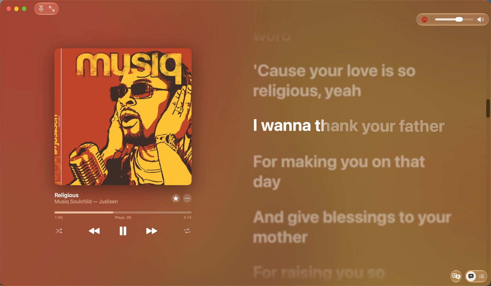
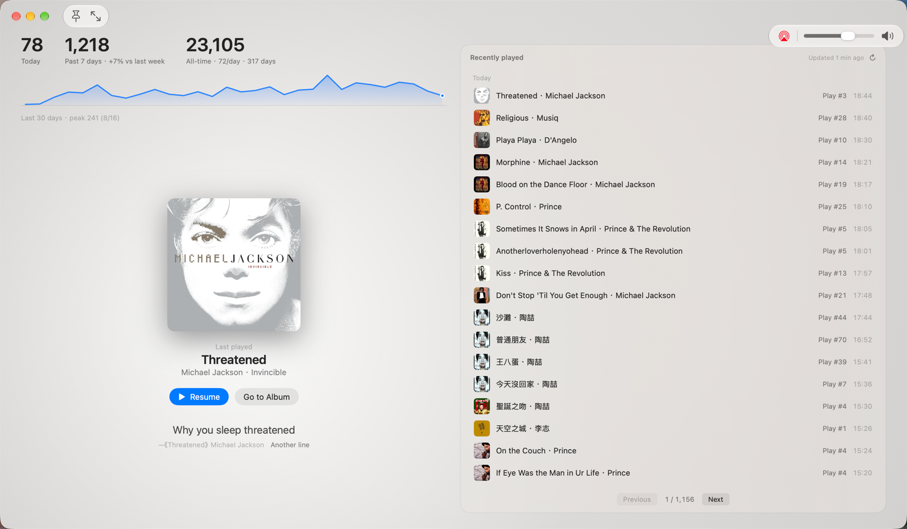
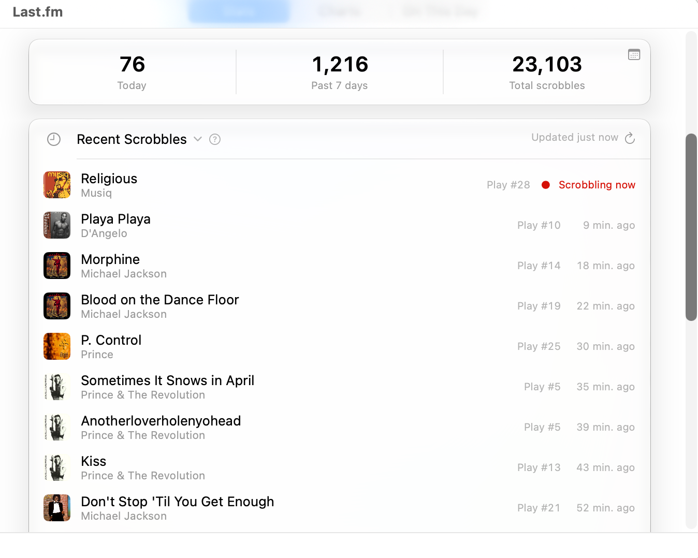
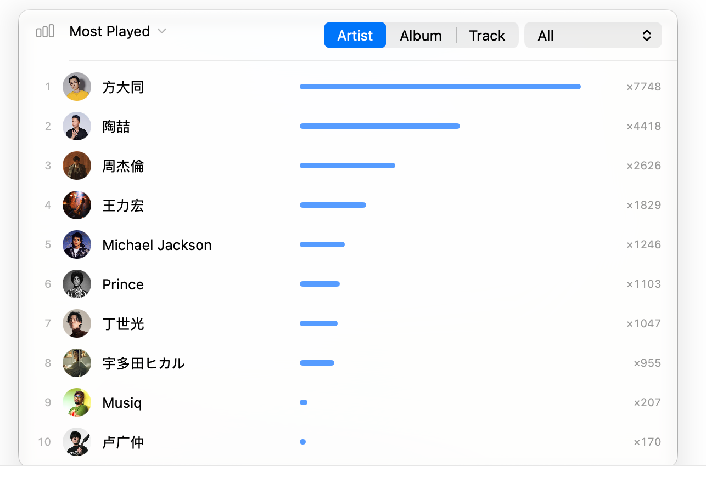
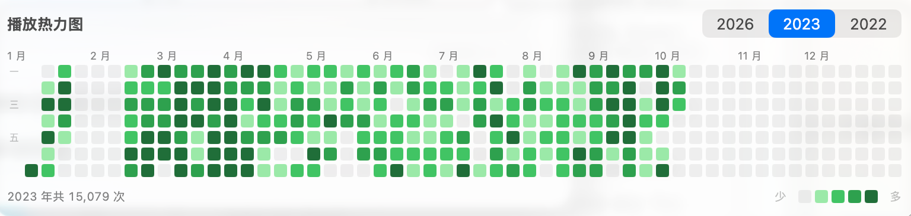
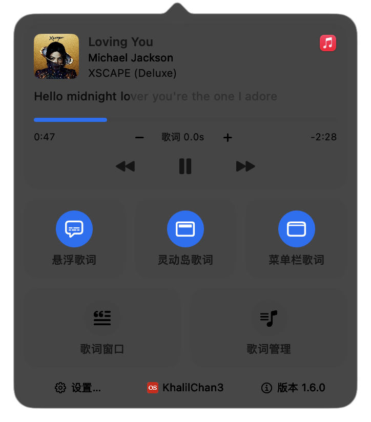
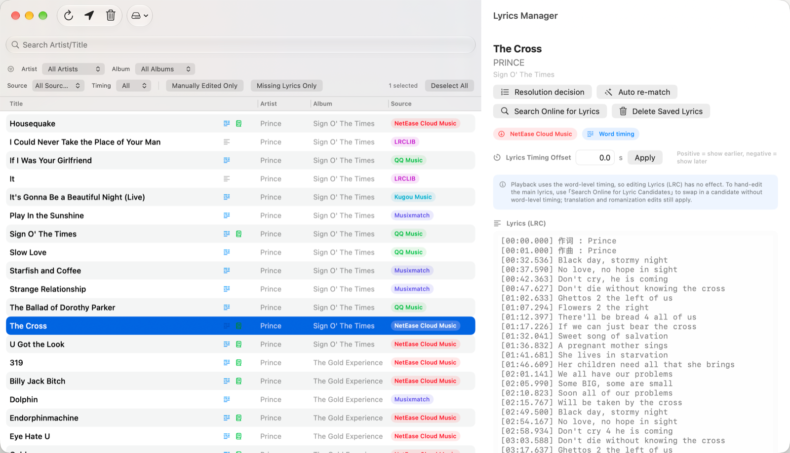
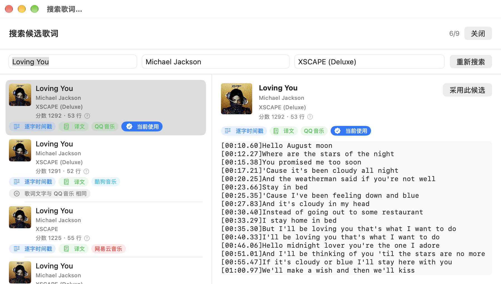

<div align="center">


# Lyrimuse

**Real-time, word-synced lyrics on your Mac desktop — plus a Last.fm listening profile and on-device translation — for Apple Music, QQ Music, NetEase Cloud Music, Kugou Music, Spotify, or YouTube Music / Spotify Web playing in your browser.**

**Language / 语言:** **English** | [简体中文](README.zh-CN.md)


[](LICENSE)

</div>

Lyrimuse sits quietly in your menu bar and shows a floating lyrics window that follows whatever's playing — Apple Music, QQ Music, NetEase Cloud Music, Kugou Music, Spotify, or YouTube Music / Spotify Web in a browser; pick any combination, or just let it auto-detect — word by word, in sync, always on top, across every Space. Think of the "desktop lyrics" experience from NetEase Cloud Music, but native to macOS.

<table>
<tr>
<td align="center" width="33%"><br><sub>Classic floating overlay</sub></td>
<td align="center" width="33%"><br><br><sub>Dynamic-Island-style capsule (no physical notch required) — expands while playing, collapses to a pill when paused</sub></td>
<td align="center" width="33%"><br><sub>Menu bar text mode, with karaoke-style highlighting</sub></td>
</tr>
<tr>
<td align="center"><br><sub>Lyrics Window, modelled on the Apple Music lyrics page</sub></td>
<td align="center"><br><sub>Same window, showing a listening overview when nothing's playing</sub></td>
</tr>
<tr>
<td align="center"><br><sub>Last.fm listening profile — totals and recent scrobbles</sub></td>
<td align="center"><br><sub>Last.fm profile — Top Artists / Albums / Tracks chart</sub></td>
</tr>
<tr>
<td colspan="2" align="center"><br><sub>Listening Heatmap — a GitHub-contributions-style yearly calendar, built from your full Last.fm history</sub></td>
</tr>
<tr>
<td align="center"><br><sub>Everything reachable from the menu bar dropdown</sub></td>
<td align="center"><br><sub>Settings, with a live preview of every change</sub></td>
</tr>
<tr>
<td align="center"><br><sub>Lyrics Manager — browse, hand-edit, and re-match any track's lyrics</sub></td>
<td align="center"><br><sub>Every candidate scored and labelled, so a wrong version is obvious before you pick it</sub></td>
</tr>
</table>

## Features

### Lyrics that just work
- **Word-by-word synced highlighting**, following playback in real time
- **Eight lyrics sources checked automatically** — NetEase Cloud Music, QQ Music, Kugou, Kuwo, Musixmatch, LRCLIB, LyricFind (via YouTube Music), and AMLL (a hand-curated, word-by-word lyrics database) — always picks the best match, no manual searching required
- **Romanization and translation**, shown alongside the original lyrics — translation comes from the source's own community translation when one exists, otherwise from on-device machine translation (Apple's Translation framework — lyrics never leave your Mac) with an online fallback, in any of 18 target languages; romanization is judged per line, so a Chinese song quoting one Japanese line only gets a reading on that line, not pinyin sprinkled over the rest — and Cantonese songs get word-aware Jyutping readings
- **Duet and multi-singer lyrics show each part separately**, when the source (or an AMLL entry) marks who's singing which line, instead of interleaving both voices into one confusing block
- **Simplified/Traditional Chinese**, switchable for the lyrics text independent of the app's own UI language
- **A full Lyrics Manager window** — browse, hand-edit, delete, or re-search lyrics for any track, with multi-select batch delete, resizable columns, and per-track timing offset if the sync ever drifts
- **Works fully offline** in local mode — no network round-trip needed to show lyrics that are already cached

### Your listening profile
- **A real listening profile, not just scrobbling** — connect Last.fm in one click from the main Accounts section (no manual token juggling) and see today/7-day/all-time totals, a live "now scrobbling" indicator, and a real-time recent-plays list with covers. Lyrimuse submits the metadata your player reported, unchanged — it never rewrites artist or track names before sending ([how scrobbling works](docs/scrobbling.md))
- **Top Artists / Albums / Tracks chart**, filterable by time period (7 days, 30 days, a year, or all-time), plus an on-this-day look-back at what you were playing in years past
- **Every play is logged locally first**, even before you connect Last.fm — connect it later and a backfill queue catches up on everything logged while you were still deciding
- **That same local history also shows up in the Lyrics Window** — when nothing's playing, it becomes a listening overview instead of an empty screen (more on this below)

### Show it your way
- **Choose your players — plural — or let it auto-detect**: reads what's playing from Apple Music (via Automation access), or QQ Music / NetEase Cloud Music / Kugou Music / Spotify (via macOS's system-level MediaRemote — no permission needed); select any combination in Settings, or leave it on auto-detect to follow whichever app macOS currently considers "Now Playing"
- **Web players work too**: pair the browser of your choice once and YouTube Music or Spotify Web becomes a first-class player — lyrics sync precisely to the page's own progress bar, with a one-click self-test that tells you whether the browser can actually be driven
- **Three ways to display it**: a classic desktop overlay, a Dynamic-Island-style capsule docked at the top of the screen (optionally showing the album artwork, and blurring it behind the capsule), or a resizable Lyrics Window modelled on the Apple Music lyrics page — two columns, a blurred cover backdrop, and the full sheet auto-scrolling to the current line — turn on any combination, or none
- **Menu bar text mode** — read the current line directly from the status bar instead of a floating window; long lines scroll rather than getting cut off mid-sentence (truncating is still one toggle away)
- **Drag the progress bar to seek** — the bars in the Lyrics Window and the notch are controls, not just indicators
- **Jump straight to the current song's page** from the "⋯" menu or the info panel — Apple Music opens in-app, QQ Music and NetEase Cloud Music open their web page for the song, album, or artist — no searching required, since Lyrimuse already resolved the link while fetching lyrics
- **When nothing's playing, the Lyrics Window shows a listening overview instead of an empty screen** — today/this-week totals, an on-this-day card, and a full recently-played list with covers, each one jumping straight to its Apple Music album/artist page
- **Fully customizable look**: font (or follow the system), size, text/background/shadow colors with savable custom themes or a color pulled from the current album art, overlay width
- **Hide during screenshots, recordings, or screen shares** — stays visible to you, invisible to everyone else
- **Auto-hide when paused** so it never sits on your desktop doing nothing

### Just a good Mac citizen
- **Simplified Chinese, Traditional Chinese and English UI**, switches instantly, no restart needed
- **Global keyboard shortcuts** for every action, all left unbound by default so you decide
- **Checks for updates on its own** (or on demand from the menu bar) — no need to keep revisiting the Releases page
- **Optional companion launch** with your chosen player, in either direction — launch one when the other opens
- **Export or import your whole configuration** to move to a new Mac, plus a one-click diagnostics export for troubleshooting

### Optional extras
Everything below is opt-in and off by default — turn on only what you want, right from Settings:

- **Also scrobble to [ListenBrainz](https://listenbrainz.org)** — connect it alongside Last.fm and every play is submitted to both from the exact same real-time read of your player, so the two histories never drift apart; your iPhone's plays (recorded via Last.fm) get automatically bridged into ListenBrainz too, for one unified history across both devices instead of two separate ones
- **A shareable public "now playing" page** — live playback, history, a guestbook, reactions, a visitor counter, a Top-10-artists leaderboard, a vinyl-record visual, light/dark themes, and rich link previews when shared in chat apps. See the **[Web Features Guide](https://github.com/Yudaotor/nowplaying-workers#readme)** for a full walkthrough with screenshots.
- **A weekly listening digest**, delivered as a push notification (Bark, DingTalk, WeCom, Discord, Feishu, or ServerChan)

Every extra above lives under Settings → **Add-on Features**, and each account card has its own step-by-step setup guide built right in — where to grab an API key or token, how to connect an account, how to get a webhook URL for whichever push platform you pick. The web page is the one that gets a dedicated guide instead of an in-app popover, but it's not a hard requirement either: configuring ListenBrainz alone already lets the page show live playback and history, no Cloudflare Worker needed. Deploying one on top adds the guestbook, reactions, visitor counter, Top-10-artists leaderboard, and lower-latency updates — see the guide if you want those.

## Getting Started

Lyrimuse ships ad-hoc signed — same as it's always been — so there's no Apple Developer account involved with any option below. That also means Gatekeeper will flag it as "from an unidentified developer" the first time it's opened, downloaded any way except Option A below (which clears it automatically) — that's expected, not a bug, and Option B covers the one-time manual fix.

### Option 0: Hand the install to an AI

Running an AI agent that can use the terminal on your Mac (Claude Code, Codex CLI, Gemini CLI, …)? Paste the block below into it as-is, and it will do everything in Options A/B for you. The instructions only let it install this one app — no `sudo`, no touching system-wide security settings:

```text
Please install Lyrimuse — an open-source macOS menu-bar lyrics app
(https://github.com/Yudaotor/lyrimuse) — on this Mac, following these rules exactly:

1. Preferred path (if `brew` exists):
     brew tap yudaotor/lyrimuse
     brew trust --cask yudaotor/lyrimuse/lyrimuse
     brew install --cask lyrimuse
   If this Homebrew doesn't know the `trust` subcommand, skip that line — older
   versions don't need it.
2. If Homebrew is not installed, do NOT install Homebrew. Instead: check the CPU
   with `uname -m`, download the latest release asset from
   https://github.com/Yudaotor/lyrimuse/releases — `Lyrimuse-<version>-macos.zip`
   for arm64, `Lyrimuse-<version>-macos-intel.zip` for x86_64 — verify it against
   its `.sha256` file (`shasum -c`), unzip, move `Lyrimuse.app` into
   /Applications, then clear the Gatekeeper quarantine flag on that one app only:
     xattr -dr com.apple.quarantine /Applications/Lyrimuse.app
3. Safety rails: no `sudo` anywhere (nothing here needs it); never run
   `spctl --master-disable` or otherwise weaken Gatekeeper system-wide; never
   remove the quarantine flag from anything except /Applications/Lyrimuse.app.
4. Do not build from source unless I explicitly ask.
5. Launch it (`open -a Lyrimuse`) and verify it is running (`pgrep -x Lyrimuse`
   prints a PID).
6. A first-run wizard will appear — that part is mine to click through. Tell me
   it will ask me to pick a music player, to grant Automation access to
   Music.app (only if I pick Apple Music), and to enable the background
   collector service — then hand control back to me.
Finally, report what you did and anything that failed.
```

### Option A: Install via Homebrew (recommended)

```bash
brew tap yudaotor/lyrimuse
brew trust --cask yudaotor/lyrimuse/lyrimuse   # one-time -- Homebrew requires this for any non-official tap
brew install --cask lyrimuse
```

This clears the one-time Gatekeeper quarantine automatically as part of installing, so there's no follow-up step — open Lyrimuse from `/Applications` (or Spotlight) right after `brew install` finishes. `brew upgrade --cask lyrimuse` picks up new releases the same way.

### Option B: Download a pre-built release manually

1. Grab it from the [Releases page](https://github.com/Yudaotor/lyrimuse/releases). **Check which Mac you have first** ( → About This Mac → "Chip": `Apple M…` is Apple Silicon, `Intel Core…` is Intel):

   | Your Mac | Download |
   | --- | --- |
   | Apple Silicon (M1 and later) | `Lyrimuse-*-macos.dmg` or `.zip` |
   | Intel | `Lyrimuse-*-macos-intel.dmg` or `.zip` |

   With the dmg, double-click to mount and drag `Lyrimuse.app` onto the `Applications` shortcut next to it; with the zip, unzip and drag `Lyrimuse.app` into `/Applications`. Both formats install exactly the same app, and the zip comes with a `.sha256` if you want to verify the download (`shasum -c Lyrimuse-*.zip.sha256` from the same folder).

   The only difference between the two downloads is architecture: the one without a suffix is Apple Silicon only, while `-intel` carries both Intel and Apple Silicon code. `-intel` does run on Apple Silicon, but there is no reason to use it there — it is twice the size, and macOS 27 and later will warn that the app "needs to be updated" because it contains Intel code (Apple is removing Rosetta in macOS 28; nothing is actually wrong with the app).

   **Both architectures get in-app auto-updates.** The feed lists two entries for the same version, one per architecture: Apple Silicon is served the unsuffixed build, Intel is served the `-intel` one, and Sparkle picks per machine on its own. (v1.4.0 and earlier served Apple Silicon only; Intel users had to come back here by hand.)
2. On first launch, macOS will refuse to open it — "Lyrimuse can't be opened because Apple cannot check it for malicious software" or "is from an unidentified developer." Clear it once, with whichever of these you're more comfortable with:

   - **Recommended — Terminal (always works):**
     ```bash
     xattr -dr com.apple.quarantine /Applications/Lyrimuse.app
     ```
     Then open the app normally. You only need to do this once per download.
   - **Right-click → Open:** In Finder, right-click (or Control-click) `Lyrimuse.app` and choose **Open**, then confirm **Open** again in the dialog. Doesn't work on every macOS version for every kind of warning — fall back to the Terminal command above if it doesn't clear.
   - **System Settings → Privacy & Security:** Try opening the app once (it'll be blocked), then open **System Settings → Privacy & Security**, scroll to the bottom, and click **Open Anyway** next to the Lyrimuse warning. Confirm once more if prompted.

   Only run these against a build you actually trust — the one from this repo's own Releases page, or one you built yourself.

### Option C: Build from source

**One-time prerequisites** (skip anything you already have):

```bash
xcode-select --install   # Xcode Command Line Tools, for Swift — skip if `swift --version` already works
brew install go          # any Go ≥ 1.21 — build.sh switches to 1.24.4 automatically via GOTOOLCHAIN
```

Then `build.sh` builds both the app and its background collector in one shot:

```bash
git clone https://github.com/Yudaotor/lyrimuse.git
cd lyrimuse/lyrimuse
./build.sh              # this machine's architecture
./build.sh --universal  # arm64 + x86_64 (the compatibility build shipped for Intel)
```

`build.sh` ends by listing the architectures of every binary in the bundle and flags anything that does not match the target — a missing slice or an extra one. Don't assemble release assets by hand: `./package.sh` builds each architecture once and produces a zip + sha256 + dmg for each, refusing to package if the architectures are wrong.

QQ Music / NetEase Cloud Music / Kugou Music / Spotify / auto-detect support additionally needs [ungive/media-control](https://github.com/ungive/media-control) — `build.sh` installs it via Homebrew automatically if it's missing, so this isn't a step you need to do yourself either.

### After any option

Open Lyrimuse from `/Applications` — the first-run wizard walks you through picking a player (Apple Music, QQ Music, NetEase Cloud Music, Kugou Music, Spotify, or auto-detect), granting Automation access to Music.app if you picked Apple Music (the others need no extra permission), and enabling its background collector service (so lyrics/artwork keep resolving even when the window's closed). Complete the wizard and lyrics will appear right away (see [lyrimuse/README.md](lyrimuse/README.md) for more build options).

You don't need to configure anything else to get lyrics — every optional extra above is configured later, entirely from Settings.

## FAQ

**Do I need an Apple Developer account to install this?**
No. Lyrimuse ships ad-hoc signed, like it always has — no developer account for you, or for the project. See "Getting Started" above for the one-time Gatekeeper step this implies.

**Does it work with Spotify, QQ Music, or NetEase Cloud Music, or only Apple Music?**
All of them, plus Kugou Music — five players in total, or let it auto-detect whichever one macOS currently considers "Now Playing." Apple Music is read via Automation access; the other four need no extra permission at all, since they're read through macOS's own system-level MediaRemote.

**Is this the same as NetEase Cloud Music's built-in desktop lyrics?**
Same idea, not the same app — Lyrimuse brings that floating-desktop-lyrics experience to any of five players (not just NetEase's own client), native to macOS, with a Dynamic-Island-style option and a full Apple-Music-style lyrics window on top of the classic overlay.

**Will lyrics work without an internet connection?**
Once a song's lyrics have been resolved once, yes — local mode shows already-cached lyrics with no network round-trip. The initial lookup (and machine translation, when it's needed) does require a connection.

**Does any of my data leave my Mac?**
Lyrics resolution talks to public lyric APIs (NetEase, QQ, Kugou, Kuwo, Musixmatch, LRCLIB, LyricFind, AMLL) and cover art to the iTunes Search API, for whatever's playing — that's inherent to the feature. Translation defaults to on-device (Apple's Translation framework) and only sends lyric text to a network translator (MyMemory) as a fallback. Everything else — your local listening history, cached lyrics, settings — stays in files on your Mac unless you explicitly connect Last.fm, ListenBrainz, or the optional web relay. The itemized list is under [License and Copyright](#license-and-copyright) below.

**Can I get Japanese/Korean romanization or Chinese translation of the lyrics?**
Yes — romanization is judged per line (so a song mixing languages doesn't get the wrong treatment on the wrong lines), and translation comes from either a lyric source's own community translation or on-device/online machine translation, in 18 target languages.

**Does it support Intel Macs?**
Yes, via a separate universal build (see Option B above). **The in-app auto-updater covers Intel too** (since v1.5.0) — once installed it prompts for new versions just like on Apple Silicon.

## License and Copyright

- **Lyrimuse itself is [GPL-3.0](LICENSE).** The open-source components and dictionary data shipped inside the app (media-control, Sparkle, KeyboardShortcuts, and the OpenCC and rime-cantonese dictionaries) keep their own licenses; the full texts are in [THIRD_PARTY_LICENSES](THIRD_PARTY_LICENSES), which is also bundled into the app and can be opened from **Settings → About → Third-party licenses**.
- **Lyrics, artwork and track metadata belong to their respective rights holders.** Lyrimuse only looks them up, caches them and displays them: whatever the public lyric APIs return is stored on your own Mac (`~/.config/lyrimuse/`) for your own viewing. It does not host, relay or redistribute lyrics or artwork, and the cache can be deleted at any time from Lyrics Manager or by removing that folder.
- **Lyrimuse is an independent open-source project.** It is not affiliated with, endorsed by or connected to Apple, Tencent (QQ Music), NetEase (NetEase Cloud Music), Kugou, Kuwo, Spotify, Google (YouTube Music), Last.fm, ListenBrainz, Musixmatch, LRCLIB, LyricFind or AMLL. Their names and trademarks belong to their owners and appear here only to say which players and lyric sources are supported.
- **This is everything that leaves your Mac.** Lyrics resolution sends the track's artist, title and album (plus the duration, for sources that accept it) to the eight lyric sources above; when none of them matches, the artist name is also sent to MusicBrainz for alias lookup. Cover art and the idle page send artist + title to the iTunes Search API. The machine-translation fallback (off by default, and used only when on-device Apple translation is unavailable) sends the **lyric text itself**, in chunks, to MyMemory, with a randomly generated e-mail parameter — never yours. Musixmatch's domain is resolved over DNS-over-HTTPS via Cloudflare (1.1.1.1) and Google (8.8.8.8). The About page asks the GitHub API for the star count at most once every six hours; update checks fetch the appcast from GitHub Releases and send no system profile. Beyond that, only the services you connect yourself: Last.fm, ListenBrainz, push-notification platforms, the optional web relay (whose Top-10 artists page looks up artist avatars on Deezer). Every outbound request is written to a local audit log — host and operation only, never parameters or credentials — which "Export diagnostics" includes.

## Troubleshooting

If lyrics stop appearing, ask the collector what is wrong:

```sh
/Applications/Lyrimuse.app/Contents/Resources/collector healthcheck
/Applications/Lyrimuse.app/Contents/Resources/collector healthcheck -local-only  # no network
/Applications/Lyrimuse.app/Contents/Resources/collector healthcheck -json
```

It checks the things that silently break the pipeline — a config field that
failed to parse, no lyric sources enabled, an unreadable cache, a lyrics export
directory that is not writable — and then probes the enabled lyric sources with
two real lookups (one Chinese, one English, so that neither catalogue's blind
spot looks like an outage). A single dead source is a warning; only all of them
failing is an error, because the others still produce lyrics.

## Uninstalling

Dragging `Lyrimuse.app` to the Trash is **not** enough. The background collector is
registered with launchd as a `KeepAlive` job, so its LaunchAgent stays behind and
launchd keeps trying to start a binary that is no longer there.

```sh
lyrimuse/scripts/uninstall.sh              # report only — shows what is installed
lyrimuse/scripts/uninstall.sh --services   # unregister both launchd jobs, keep your data
lyrimuse/scripts/uninstall.sh --purge      # also delete config, caches, logs and settings
```

Running it with no arguments changes nothing; it just tells you what is on your
system. `--purge` lists everything it is about to delete, warns you how many exported
lyrics files are among them, and requires you to type `yes`.

`--services` leaves your settings alone. `--purge` also removes them
(`defaults delete me.yudaotor.lyrimuse`), because leaving them behind puts a
reinstall into a dead end: the LaunchAgent is gone, so the collector is not
installed, but the app still thinks onboarding is done — so the wizard that would
install it never appears, and the desktop just sits at "searching for lyrics".

## Project Layout

This repo is the app:

- [`lyrimuse/`](lyrimuse) — the app itself (Swift, SwiftUI + AppKit)
- [`lyrimuse-collector/`](lyrimuse-collector) — the background engine that resolves lyrics/artwork and feeds them to the app (Go); built and bundled into the app automatically
- [`docs/features/`](docs/features/README.md) — the as-built feature spec: 15 chapters covering every feature's current behavior, interactions, and code anchors (read the relevant chapter before changing anything)

The optional web experience lives in two sibling repos, so you can fork either without touching the app:

| Repo | Role |
|---|---|
| [`Yudaotor/nowplaying`](https://github.com/Yudaotor/nowplaying) | The shareable "now playing" web page itself, plus a fork-ready template |
| [`Yudaotor/nowplaying-workers`](https://github.com/Yudaotor/nowplaying-workers) | The Cloudflare Worker relay + live README badge behind it, with a complete from-scratch setup guide |

```
this repo (app + collector)  ──push──▶  nowplaying-workers (relay)  ◀──read──  nowplaying (web page)
```

## Credits

The desktop-lyrics concept owes a debt to [LyricsX](https://github.com/ddddxxx/LyricsX).
