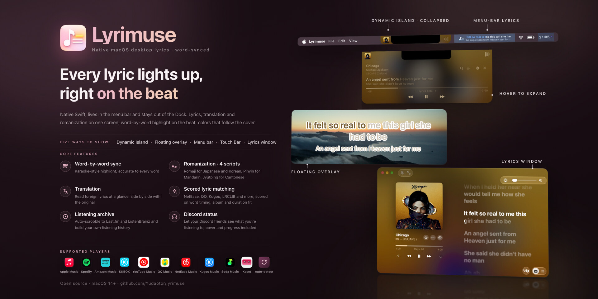

<div align="center">


# Lyrimuse

**Desktop lyrics, reimagined for the Mac.**

**Language / 语言 / 語言:** **English** | [简体中文](README.zh-CN.md) | [繁體中文](README.zh-Hant.md)


[](https://github.com/Yudaotor/lyrimuse/releases/latest)
[](https://github.com/Yudaotor/lyrimuse/commits/dev)
[](LICENSE)
[](https://github.com/sponsors/Yudaotor)

</div>

https://github.com/user-attachments/assets/59250bba-4fb4-452e-a76a-b6c473bd0e97

Lyrimuse is an open-source desktop lyrics app for macOS. It lives in the menu bar and highlights lyrics word by word as the song plays: floating always on top of your windows, in the menu bar, in a Dynamic-Island-style capsule under the notch, or in a full lyrics window. It works with nine players, including Apple Music, Spotify, Amazon Music and the YouTube Music app Kaset, plus web players in your browser, and picks the best match from twelve lyrics sources, with translation and romanization when you want them. It also keeps a Last.fm listening profile and scrobbles your plays.

**Coming from LyricsX?** It hasn't had a new release since April 2022. Lyrimuse covers what it did, keeps getting updates, and adds support for Chinese-language players, KKBOX, Amazon Music, Kaset and web players. For the details, see the fact-checked [comparison with LyricsX and Lyric Fever](docs/lyrics-apps-comparison.md).

**Install** with Homebrew, on Apple Silicon or Intel. It also clears the first-launch Gatekeeper warning for you. Prefer to download it yourself? Grab the [latest release](https://github.com/Yudaotor/lyrimuse/releases/latest) and see [Getting Started](#getting-started).

```bash
brew tap yudaotor/lyrimuse
brew trust --cask yudaotor/lyrimuse/lyrimuse   # one-time: Homebrew asks you to trust non-official taps
brew install --cask lyrimuse
```


<p align="center"><sub>Four ways to show lyrics: the Lyrics Window, the Dynamic-Island-style capsule, the floating overlay with word-by-word highlight, and the menu bar</sub></p>


<p align="center"><sub>Lyrics Manager, manual search with a score on every result, and the panel that shows why a song got the lyrics it got</sub></p>


<p align="center"><sub>Your Last.fm numbers and charts, the overview you see when nothing's playing, and a GitHub-style heatmap of your year</sub></p>


<p align="center"><sub>Every settings page has a live preview, you can pick more than one player (web players too), and the menu bar dropdown has the rest</sub></p>

## Features

### Word-by-word synced lyrics, matched automatically
- **Word-by-word highlighting** that keeps up with the song as it plays.
- **Twelve lyrics sources, searched for you**: NetEase Cloud Music, QQ Music, Kugou, Kuwo, Migu, Musixmatch, LRCLIB, LyricFind (through YouTube Music), Deezer, AMLL (a hand-curated word-by-word lyrics database), Soda Music (its own word-by-word timing), and Apple Music's lyrics if you connect your account in Settings. Apple Music is the only official source of the bunch, and many of its tracks have word timing. You never have to search yourself.
- **Translation and romanization** under the original lyrics. If the source has a community translation, you get that. If not, your Mac translates the lyrics with Apple's Translation framework, so they never leave your computer, and an online translator steps in when that can't. There are 17 target languages. Romanization is decided line by line: a Chinese song with one Japanese line gets a reading on that line only, not pinyin all over the rest. Cantonese songs get Jyutping that understands whole words.
- **Duets split by singer.** When the source (or an AMLL entry) marks who sings which line, each part is shown on its own instead of two voices mashed into one block.
- **The Apple Music touches in the Lyrics Window**: background vocals on their own line under the main one, overlapping duet lines lit up together until both finish, and long held English words that swell and glow the way Apple Music does it.
- **Simplified or Traditional Chinese** for the lyrics, set separately from the app's own language.
- **Lyrics Manager**, for when you want to tidy up. Browse, edit, delete or search again for any song, delete many at once, and resize the columns. If one song's timing is off, shift just that song. One button retries every song that still has no lyrics, and a full rescan re-picks your whole library with the current matching rules. Anything you fixed by hand is left alone.
- **Works offline** for any song whose lyrics are already cached.

### Last.fm listening profile and scrobbling
- **A full listening profile.** Connect Last.fm in one click from the Accounts section (no token to copy and paste) and you get today, last-7-days and all-time totals, a live "now scrobbling" indicator, and your recent plays with covers, each with a heart for loving it (or taking the love back) on Last.fm. By default each play is sent as the matching track in Last.fm's catalogue, so duet credits, Simplified / Traditional spellings and tails like " - Single" or "(Remastered)" land on the real track page; switch to Raw in Settings to send exactly what the player reported. ListenBrainz always gets the original tags ([how scrobbling works](docs/scrobbling.md)).
- **Top artists, albums and tracks** for the last 7 days, 30 days, year or all time, each with how far it moved since the previous period. Click an artist to see the songs of theirs you play most.
- **Footprint**, a tab of its own. It opens with your running totals: how many days since your first scrobble, how many of them had plays and the daily average, your biggest day, your current and longest streak, this year so far against the same stretch of an earlier year, and how far you are from the next round-number milestone. Below that come a GitHub-style heatmap of the year, when you listen by hour and weekday, where your top artists are from, and "On This Day", with what you played on this date in years past.
- **Every play is saved on your Mac first**, even before you connect Last.fm. Connect later and it catches up on everything in between.
- **You decide when a play counts**: at 50% like Last.fm's default, at 75% or 90%, or only when the song actually finishes. ListenBrainz isn't affected. You can also keep a player out of Last.fm completely, so its plays never show up in your history.
- **The same history shows up in the Lyrics Window** when nothing's playing, so you get an overview instead of a blank screen (more on that below).

### Floating overlay, menu bar lyrics, Dynamic Island, or a full lyrics window
- **Use several players, or let it pick.** Apple Music, Spotify and Kaset are read with Automation access. QQ Music, NetEase Cloud Music, Kugou Music, Soda Music, KKBOX and Amazon Music are read through macOS's MediaRemote and need no permission. Turn on any mix in Settings, or leave it on auto-detect and it follows whatever macOS shows as Now Playing.
- **Apple Music radio works too.** The lyrics keep up with each song on a station. While the host is talking you see the station's name and logo, not the song before. Radio gets its own timing offset, so you can fix a station once and forget about it.
- **So do players in your browser.** Pair your browser once and YouTube Music or Spotify Web works like any other player, with lyrics synced to the page's own progress bar. A one-click test tells you up front whether the browser can be controlled at all. During an ad the capsule turns black and shows how long is left and which ad of how many this is. YouTube Music ads get a skip button, or can be skipped automatically.
- **Pick how you want to see it**, any combination or none at all:
  - a desktop overlay you can drag anywhere, or pin to the top center or just above the Dock;
  - a Dynamic-Island-style capsule at the top of the screen, which can show the album art and blur it behind the capsule;
  - a resizable Lyrics Window modelled on Apple Music's lyrics page, with two columns, a blurred cover in the background, the whole song scrolling along to the current line, and moving album art when Apple Music has a motion cover for the record.
- **Menu bar lyrics (text mode).** The current line sits right in the menu bar. Long lines scroll instead of getting cut off halfway (you can switch back to cutting them off). A second row can show the next line, the translation or the romanization, and the capsule can do the same.
- **Drag the progress bar to seek**, in the Lyrics Window and in the capsule.
- **Open the song where it lives** from the "⋯" menu or the info panel. Apple Music opens in the app, Spotify jumps to the track that's playing, and KKBOX opens the song, album or artist in its own app. QQ Music, Soda Music, Spotify, Amazon Music and YouTube Music (when you play it in Kaset) open the song, album or artist page on the web, and NetEase Cloud Music opens the song page. Lyrimuse found the link while fetching lyrics or read it from the player's own data on your Mac, so there's nothing to search.
- **When nothing's playing**, the Lyrics Window shows today's and this week's totals, an "On This Day" card, and your recent plays with covers, each one linking to its album or artist page in Apple Music.
- **A mini Lyrics Window**: a small card with the current and next line, compact or multi-line, with its own background, text color and font.
- **Album notes and artist bios.** Click the artist or album name in the Lyrics Window or the expanded capsule to read about them, from Apple Music, or from Last.fm when Apple Music has nothing.
- **Make it look the way you like**: the font (the system one, or your own .ttf / .otf files), size, text / background / shadow colors, saved themes or a color taken from the current album art, and the overlay's width.
- **Hidden in screenshots, recordings and screen shares.** You still see it. Nobody else does.
- **Hides itself when you pause**, so it isn't sitting on your desktop doing nothing.

### Everyday details
- **Simplified Chinese, Traditional Chinese and English**, and switching takes effect right away, no restart.
- **Keyboard shortcuts** for every action. None are set out of the box, so you pick the keys.
- **Search in Settings.** Type in the sidebar and it scrolls to the matching row and highlights it, opening a collapsed group if it needs to.
- **Updates itself.** It checks on its own, or when you ask from the menu bar. Updates install from the Software Update page in Settings, with the release notes and progress right there, and you can opt in to beta builds.
- **Start together with your players**, set per player and in either direction: open them when Lyrimuse opens, open Lyrimuse when they open, and if you like, quit Lyrimuse once all the players it follows have quit.
- **Moving to a new Mac?** Export your whole setup and import it there. If something goes wrong, there's also a one-click diagnostics export.

### Optional extras

<details>
<summary>ListenBrainz, Discord status, a shareable now-playing page, and daily / weekly / monthly / yearly digests</summary>

All of these are off until you turn them on in Settings:

- **Scrobble to [ListenBrainz](https://listenbrainz.org) as well.** Every play goes to both services from the same read of your player, so the two histories stay in step. Plays from your iPhone (recorded through Last.fm) get copied into ListenBrainz too, so you end up with one history across both devices instead of two.
- **A public "now playing" page you can share**: live playback, history, a guestbook, reactions, a visitor counter, a top-10 artists board, a vinyl record look, light and dark themes, and proper link previews in chat apps. The **[Web Features Guide](https://github.com/Yudaotor/nowplaying-workers#readme)** walks through it with screenshots.
- **Daily, weekly, monthly and yearly listening digests**, sent as a push notification (Bark, DingTalk, WeCom, Discord, Feishu, ServerChan or Telegram).
- **Show what you're listening to on Discord.** Your profile and friends list show the player you're using, the song, the artist, the album art and a progress bar, and the song title and artist link to their pages on that player's site. A small Lyrimuse or player badge sits on the cover corner (or none), and a paused song can stay up with a pause icon. You choose which players count, and you can hide it for a while.

You'll find them all under Settings → **Add-on Features**, and each card comes with its own setup steps: where to get an API key or token, how to connect an account, how to get a webhook URL for your push service. The web page is the only one with a separate guide, and you don't need all of it. With just ListenBrainz set up, the page already shows live playback and history, no Cloudflare Worker needed. Deploy one if you also want the guestbook, reactions, visitor counter, top-10 board and faster updates; the guide covers that.

</details>

## Getting Started

Releases are signed with the project's own certificate, not an Apple Developer ID, so none of the options below involve an Apple Developer account. The catch is that the first time you open the app, Gatekeeper says it's "from an unidentified developer". Homebrew (Option A) clears that for you. With the other options it's expected, not a bug, and Option B shows how to get past it once.
### Option 0: Hand the install to an AI

Running an AI agent that can use the terminal on your Mac (Claude Code, Codex CLI, Gemini CLI, …)? Paste the block below into it as-is, and it will do everything in Options A/B for you. The instructions only let it install this one app. It won't use `sudo` or touch system-wide security settings:

```text
Please install Lyrimuse — an open-source macOS menu-bar lyrics app
(https://github.com/Yudaotor/lyrimuse) — on this Mac, following these rules exactly:

1. Preferred path (if `brew` exists):
     brew tap yudaotor/lyrimuse
     brew trust --cask yudaotor/lyrimuse/lyrimuse
     brew install --cask lyrimuse
   If this Homebrew doesn't know the `trust` subcommand, skip that line — older
   versions don't need it.
2. If Homebrew is not installed, do NOT install Homebrew. Instead: check the CPU
   with `uname -m`, download the latest release asset from
   https://github.com/Yudaotor/lyrimuse/releases — `Lyrimuse-v<version>-macos.zip`
   for arm64, `Lyrimuse-v<version>-macos-intel.zip` for x86_64 — verify it against
   its `.sha256` file (`shasum -c`), unzip, move `Lyrimuse.app` into
   /Applications, then clear the Gatekeeper quarantine flag on that one app only:
     xattr -dr com.apple.quarantine /Applications/Lyrimuse.app
3. Safety rails: no `sudo` anywhere (nothing here needs it); never run
   `spctl --master-disable` or otherwise weaken Gatekeeper system-wide; never
   remove the quarantine flag from anything except /Applications/Lyrimuse.app.
4. Do not build from source unless I explicitly ask.
5. Launch it (`open -a Lyrimuse`) and verify it is running (`pgrep -x Lyrimuse`
   prints a PID).
6. A first-run wizard will appear — that part is mine to click through. Tell me
   it will ask me to pick a music player, to grant Automation access to
   Music.app and/or Spotify (only if I pick them), and to enable the background
   lyrics engine — then hand control back to me.
Finally, report what you did and anything that failed.
```

### Option A: Install via Homebrew (recommended)

```bash
brew tap yudaotor/lyrimuse
brew trust --cask yudaotor/lyrimuse/lyrimuse   # one-time: Homebrew asks you to trust non-official taps
brew install --cask lyrimuse
```

This clears the one-time Gatekeeper quarantine automatically as part of installing, so there's no follow-up step. Open Lyrimuse from `/Applications` (or Spotlight) right after `brew install` finishes. `brew upgrade --cask lyrimuse` picks up new releases the same way.

### Option B: Download a pre-built release manually

1. Grab it from the [Releases page](https://github.com/Yudaotor/lyrimuse/releases). **Check which Mac you have first** ( → About This Mac → "Chip": `Apple M…` is Apple Silicon, `Intel Core…` is Intel):

   | Your Mac | Download |
   | --- | --- |
   | Apple Silicon (M1 and later) | `Lyrimuse-*-macos.dmg` or `.zip` |
   | Intel | `Lyrimuse-*-macos-intel.dmg` or `.zip` |

   With the dmg, double-click to mount and drag `Lyrimuse.app` onto the `Applications` shortcut next to it; with the zip, unzip and drag `Lyrimuse.app` into `/Applications`. Both formats install exactly the same app, and the zip comes with a `.sha256` if you want to verify the download (`shasum -c Lyrimuse-*.zip.sha256` from the same folder).

   The only difference between the two downloads is architecture: the one without a suffix is Apple Silicon only, while `-intel` carries both Intel and Apple Silicon code. `-intel` does run on Apple Silicon, but there's no reason to use it there: it's twice the size, and macOS 27 and later will warn that the app "needs to be updated" because it contains Intel code (Apple is removing Rosetta in macOS 28; nothing is actually wrong with the app).

   **Both architectures get in-app auto-updates.** The feed lists two entries for the same version, one per architecture: Apple Silicon is served the unsuffixed build, Intel is served the `-intel` one, and Sparkle picks per machine on its own. (v1.4.0 and earlier served Apple Silicon only; Intel users had to come back here by hand.)
2. On first launch, macOS will refuse to open it, with "Lyrimuse can't be opened because Apple cannot check it for malicious software" or "is from an unidentified developer." Clear it once, with whichever of these you're more comfortable with:

   - **Terminal (recommended, always works):**
     ```bash
     xattr -dr com.apple.quarantine /Applications/Lyrimuse.app
     ```
     Then open the app normally. You only need to do this once per download.
   - **Right-click → Open:** In Finder, right-click (or Control-click) `Lyrimuse.app` and choose **Open**, then confirm **Open** again in the dialog. It doesn't work on every macOS version for every kind of warning, so if the warning stays, use the Terminal command above.
   - **System Settings → Privacy & Security:** Try opening the app once (it'll be blocked), then open **System Settings → Privacy & Security**, scroll to the bottom, and click **Open Anyway** next to the Lyrimuse warning. Confirm once more if prompted.

   Only do this for a build you actually trust: the one from this repo's Releases page, or one you built yourself.

### Option C: Build from source

**One-time prerequisites** (skip anything you already have):

```bash
xcode-select --install   # Xcode Command Line Tools, for Swift — skip if `swift --version` already works
brew install go          # any Go ≥ 1.21 — build.sh switches to 1.24.4 automatically via GOTOOLCHAIN
```

Then `build.sh` builds both the app and its lyrics engine (the background process named `lyrimuse-engine`) in one shot:

```bash
git clone https://github.com/Yudaotor/lyrimuse.git
cd lyrimuse/lyrimuse
./build.sh              # this machine's architecture
./build.sh --universal  # arm64 + x86_64 (the compatibility build shipped for Intel)
```

`build.sh` ends by listing the architectures of every binary in the bundle and flags anything that doesn't match the target, whether a slice is missing or there's an extra one. Don't assemble release assets by hand: `./package.sh` builds each architecture once and produces a zip + sha256 + dmg for each, refusing to package if the architectures are wrong.

QQ Music / NetEase Cloud Music / Kugou Music / Soda Music / KKBOX / Amazon Music / Spotify / Kaset / auto-detect support additionally needs [ungive/media-control](https://github.com/ungive/media-control). `build.sh` installs it via Homebrew automatically if it's missing, so this isn't a step you need to do yourself either.

### After any option

Open Lyrimuse from `/Applications`. The first-run wizard walks you through picking a player (Apple Music, QQ Music, NetEase Cloud Music, Kugou Music, Soda Music, KKBOX, Amazon Music, Spotify, Kaset, or auto-detect), granting Automation access if you picked Apple Music, Spotify or Kaset (the others need no extra permission), and enabling its lyrics engine (so lyrics/artwork keep resolving even when the window's closed). Complete the wizard and lyrics will appear right away (see [lyrimuse/README.md](lyrimuse/README.md) for more build options).

That's all you need for lyrics. The optional extras can be set up later from Settings, whenever you want them.

## FAQ

### How do I get floating Apple Music lyrics on my Mac desktop, always on top?
Turn on the desktop overlay in Settings. It stays above every window, on every Space. Drag it wherever you like, or pin it to the top center or just above the Dock. If the lyrics have word timing, each word fills in as it's sung. You can hide it from screenshots, recordings and screen shares, and have it disappear while the music is paused. It works the same way with QQ Music, NetEase Cloud Music, Kugou Music, Soda Music, KKBOX, Amazon Music, Spotify, Kaset and web players.

### Can I show Spotify lyrics in the Mac menu bar?
Yes. Turn on menu bar text mode and the current line appears in the menu bar, for Spotify or any other supported player. Long lines scroll instead of being cut off, and a second row can show the next line, the translation or the romanization. You don't need to connect a Spotify account. Lyrimuse asks once for Automation access to Spotify, which gives it the exact playback position and makes the playback buttons work. If you say no, the lyrics still show, but the timing comes from macOS's MediaRemote and can be about a second off.

### Does it show word-by-word lyrics for QQ Music, NetEase Cloud Music, Kugou or Soda Music?
Yes, as long as the lyrics have word timing. NetEase Cloud Music, QQ Music, Kugou, Soda Music, Musixmatch, AMLL and Apple Music often do, and those lines fill in word by word. Lyrics with only line timing light up a whole line at once. The player doesn't limit where lyrics come from, either: a song playing in Soda Music can end up with QQ Music's word-by-word lyrics if those score best.

### Do I need an Apple Developer account to install this?
No. Releases are signed with the project's own certificate instead of an Apple Developer ID, so neither you nor the project needs one. It's also why there's a one-time Gatekeeper step, described in Getting Started above.

### Is Lyrimuse on the Mac App Store?
No. Install it with Homebrew (Option A above) or download it from the [Releases page](https://github.com/Yudaotor/lyrimuse/releases) (Option B). Either way, updates come through the app after that.

### Is Lyrimuse free?
Yes. It's open source under GPL-3.0. There's no paid version, no in-app purchase and no account to sign up for. Last.fm and the other services are up to you. If it's useful to you and you'd like to support it, you can [sponsor it on GitHub](https://github.com/sponsors/Yudaotor) or [buy the author a coffee](https://yudaotor.github.io/donate/) with Alipay or WeChat Pay.

### Does it work with Spotify, QQ Music, or NetEase Cloud Music, or only Apple Music?
All of those, plus Kugou Music, Soda Music, KKBOX, Amazon Music and Kaset (a YouTube Music app), so nine players in all. Or let it auto-detect whatever macOS shows as Now Playing. Apple Music, Spotify and Kaset ask for Automation access (Spotify and Kaset use it for exact timing and the playback buttons). The other six need no permission, because they're read through macOS's MediaRemote. With KKBOX or Amazon Music, the lyrics that app already saved for the song are considered too, and neither service is ever contacted.

### Can I show KKBOX or Amazon Music lyrics on my Mac?
Yes. Both are read through macOS's MediaRemote, so there's nothing to grant, and their lyrics show in the overlay, the menu bar, the capsule and the Lyrics Window like any other player's. If KKBOX or Amazon Music already saved lyrics for the song, those are considered too and get extra weight. Lyrimuse never signs in to either service or sends them anything. The other sources are still searched, so if one of them has something better, like word-by-word timing, that one wins.

### Does it work with a YouTube Music desktop app?
Yes, with [Kaset](https://github.com/sozercan/kaset), a native, open-source YouTube Music app for the Mac. Kaset is read with Automation access, which gives exact timing and working playback buttons, and YouTube Music's own lyrics are among the candidates. YouTube Music in the browser works too, see below.

### What do the desktop lyrics look like?
Like karaoke on your desktop. The current line floats over your windows, each word fills in as it's sung when the lyrics have word timing, and the translation or romanization can sit alongside. You can change the font, size, text, background and shadow colors, and width, and let the text color follow the album art. The same lyrics can also go in the menu bar, in a Dynamic-Island-style capsule under the notch, or in a full Apple-Music-style lyrics window, in any combination.

### Does the Dynamic Island capsule work on a Mac without a notch?
Yes. On a screen without a notch, like an older MacBook or an external display, the capsule sits at the top center, as tall as the menu bar. You choose which screen it goes on in Settings.

### Will lyrics work without an internet connection?
Yes, for any song it has already found lyrics for, since those are cached on your Mac. The first lookup for a song needs a connection, and so does online translation.

### Does any of my data leave my Mac?
To find lyrics, it has to ask the lyric sources about the song that's playing: NetEase, QQ, Kugou, Kuwo, Migu, Musixmatch, LRCLIB, LyricFind, Deezer, AMLL, Soda Music, and Apple Music if you connected it. Cover art comes from the iTunes Search API. Translation happens on your Mac by default, and lyric text only goes to an online translator (Google's web translation, then MyMemory) as a fallback. Your listening history, cached lyrics and settings stay in files on your Mac unless you connect Last.fm, ListenBrainz or the optional web relay. The full list is under [License and Copyright](#license-and-copyright) below.

### Can I get Japanese/Korean romanization or Chinese translation of the lyrics?
Yes. Romanization is decided line by line, so a song that mixes languages only gets readings where they belong. Translation comes from the lyric source's community translation when there is one, otherwise from on-device or online machine translation, into any of 17 languages.

### Which macOS versions does it support?
macOS 14 Sonoma or later (Sequoia, Tahoe and newer), on Apple Silicon or Intel. Translating on your Mac needs macOS 15 Sequoia or later; on macOS 14 only the online translators are available.

### Does it support Intel Macs?
Yes, with a separate universal build (see Option B above). Auto-updates work on Intel too, since v1.5.0, so new versions show up just like they do on Apple Silicon.

### Can it show lyrics for YouTube Music or Spotify playing in a browser?
Yes. Pair your browser once in Settings and YouTube Music or Spotify Web works like any other player. The lyrics follow the page's own progress bar instead of guessing, and a one-click test tells you before you commit whether your browser can be controlled.

### Can it scrobble Apple Music to Last.fm on a Mac?
Yes, that's the other half of the app. Connect Last.fm in one click from Settings and every play from Apple Music (or any other supported player) gets scrobbled, with a live "now playing" status. Plays are saved on your Mac first, so the ones from before you connected aren't lost; they're sent once you connect. You pick when a play counts (50%, 75%, 90% or the whole song), can leave some players out, and can send to ListenBrainz at the same time.

### How does Lyrimuse avoid picking the wrong lyrics?
It doesn't just take the first source that answers. Every result from every source is scored the same way: how well the title, artist, album and length match, plus things like whether it has word timing. The highest score wins. You can look at that decision for any song, with every candidate's score and the reason the winner won. If a better match turns up later, Lyrimuse can switch to it by itself, but lyrics you picked by hand are locked and never replaced. Manual search shows the same scores and labels, so a wrong version is easy to spot before you pick it.

### What if the lyrics are out of sync or wrong?
If the timing's off, shift it for that song; the offset is remembered. If it's the wrong lyrics or the wrong version, open manual search. You'll see every result from every source with its score, and whatever you pick is locked, so automatic matching won't swap it out. You can also edit any song's lyrics by hand in Lyrics Manager.

### Can I save the lyrics as .lrc files?
They already are. Every song with lyrics gets a `.lrc` file with line timing, plus `.tr.lrc` for the translation and `.roma.lrc` for the romanization when those exist. Word-by-word timing is saved separately as `.yrc`, in NetEase's YRC format, which most other players can't read. The files are in `~/.config/lyrimuse/lyrics/`, and you can move the folder in Settings.

### Is LyricsX still maintained, and how is Lyrimuse different from LyricsX or Lyric Fever?
LyricsX's last release was v1.6.3, in April 2022. It runs on macOS 10.11 and later and works with Apple Music, Spotify and a few older players. Lyric Fever focuses on Spotify and Apple Music and needs macOS 15. Lyrimuse needs macOS 14 and adds QQ Music, NetEase Cloud Music, Kugou, Soda Music, KKBOX, Amazon Music and Kaset, players in your browser, per-line pinyin / Cantonese Jyutping / Japanese and Korean romanization, and Last.fm / ListenBrainz scrobbling with your own listening stats. The side-by-side table is on [the comparison page](docs/lyrics-apps-comparison.md).
## License and Copyright

- **Lyrimuse itself is [GPL-3.0](LICENSE).** The open-source components and dictionary data shipped inside the app (media-control, Sparkle, KeyboardShortcuts, and the OpenCC and rime-cantonese dictionaries) keep their own licenses; the full texts are in [THIRD_PARTY_LICENSES](THIRD_PARTY_LICENSES), which is also bundled into the app and can be opened from **Settings → About → Third-party licenses**.
- **Lyrics, artwork and track metadata belong to their respective rights holders.** Lyrimuse only looks them up, caches them and displays them: whatever the public lyric APIs return is stored on your own Mac (`~/.config/lyrimuse/`) for your own viewing. It does not host, relay or redistribute lyrics or artwork, and the cache can be deleted at any time from Lyrics Manager or by removing that folder.
- **Lyrimuse is an independent open-source project.** It is not affiliated with, endorsed by or connected to Apple, Tencent (QQ Music), NetEase (NetEase Cloud Music), Kugou, Kuwo, Douyin (Soda Music), KKBOX, Amazon (Amazon Music), China Mobile (Migu Music), Spotify, Kaset, Google (YouTube Music, Google Translate), Last.fm, ListenBrainz, MusicBrainz, Musixmatch, LRCLIB, LyricFind, Deezer, AMLL or SponsorBlock. Their names and trademarks belong to their owners and appear here only to say which players, lyric sources and services are involved.
- **This is everything that leaves your Mac.** Lyrics resolution sends the track's artist, title and album (plus the duration, for sources that accept it) to the twelve lyric sources above; when none of them matches, the artist name is also sent to MusicBrainz for alias lookup (Last.fm's Smart matching does the same for artists it hasn't seen before), and the charts look up their artists there by MusicBrainz ID for country/region and links. Cover art and the idle page send artist + title to the iTunes Search API; with Kaset, the cover it reports is downloaded from YouTube Music's image server (googleusercontent.com), and each new video ID it plays is sent to YouTube Music once to check whether it is a podcast episode (those aren't treated as songs). Album notes and artist bios request the album's and artist's public Apple Music pages by their Apple Music IDs — no Apple account involved. The machine-translation fallback (off by default, and used only when on-device Apple translation is unavailable) sends the **lyric text itself**, in chunks, to Google's web translation endpoint first and whatever is still untranslated to MyMemory; the MyMemory request carries a randomly generated e-mail parameter — never yours. While a music video plays in YouTube Music, the first four characters of the video ID's SHA-256 hash go to SponsorBlock to find the video's non-music segments so the lyrics line up with the picture; SponsorBlock can't tell from that which video it is. Musixmatch's domain is resolved over DNS-over-HTTPS via Cloudflare (1.1.1.1) and Google (8.8.8.8). The About page asks the GitHub API for the star count at most once every six hours, and, if you opt into beta updates, for the release list at most once an hour; update checks fetch the appcast from GitHub Releases and send no system profile. Beyond that, only the services you connect yourself: Last.fm, ListenBrainz, push-notification platforms, the optional web relay (whose Top-10 artists page looks up artist avatars on Deezer). With "Show What You're Listening To" on in the Discord settings, the title, artist, album, player name, playback progress, cover URL and links to the song and the artist are handed to the Discord app on your Mac, which shows them on your profile; the cover is the one your player itself provides or the one already on your own web relay when possible; otherwise it is looked up on iTunes by the Apple Music track or album ID (or by artist + title). With Apple Music, the track-ID lookup also runs when the relay already has the cover, to get the artist's page. Once connected, the Discord avatar shown in Settings is downloaded from Discord's image server (cdn.discordapp.com). Every outbound request is written to a local audit log — host and operation only, never parameters or credentials — which "Export diagnostics" includes.

## Troubleshooting

If lyrics don't show up, open **Lyrics Sources** in Settings and click **Test** to see which source can't be reached. If that doesn't sort it out, use **Export Diagnostics** and attach the file to an [issue](https://github.com/Yudaotor/lyrimuse/issues); it already includes the full self-check of the background service.

<details>
<summary>Command-line self-check</summary>

The same check, run from Terminal:

```sh
/Applications/Lyrimuse.app/Contents/Resources/lyrimuse-engine healthcheck
/Applications/Lyrimuse.app/Contents/Resources/lyrimuse-engine healthcheck -local-only  # no network
/Applications/Lyrimuse.app/Contents/Resources/lyrimuse-engine healthcheck -json
```

</details>

## Uninstalling

Dragging `Lyrimuse.app` to the Trash is **not** enough. The lyrics engine (process name `lyrimuse-engine`) is
registered with launchd as a `KeepAlive` job, so its LaunchAgent stays behind and
launchd keeps trying to start a binary that is no longer there.

```sh
lyrimuse/scripts/uninstall.sh              # report only — shows what is installed
lyrimuse/scripts/uninstall.sh --services   # unregister both launchd jobs, keep your data
lyrimuse/scripts/uninstall.sh --purge      # also delete config, caches, logs and settings
```

Running it with no arguments changes nothing; it just tells you what is on your
system. `--purge` lists everything it is about to delete, warns you how many exported
lyrics files are among them, and requires you to type `yes`.

`--services` leaves your settings alone. `--purge` also removes them
(`defaults delete me.yudaotor.lyrimuse`), because leaving them behind puts a
reinstall into a dead end: the LaunchAgent is gone, so the lyrics engine is not
installed, but the app still thinks onboarding is done — so the wizard that would
install it never appears, and the desktop just sits at "searching for lyrics".

## Project Layout

This repo is the app:

- [`lyrimuse/`](lyrimuse) — the app itself (Swift, SwiftUI + AppKit)
- [`lyrimuse-engine/`](lyrimuse-engine) — the background engine that resolves lyrics/artwork and feeds them to the app (Go); built and bundled into the app automatically

<details>
<summary>The optional web page: two sibling repos</summary>

The optional web experience lives in two sibling repos, so you can fork either without touching the app:

| Repo | Role |
|---|---|
| [`Yudaotor/nowplaying`](https://github.com/Yudaotor/nowplaying) | The shareable "now playing" web page itself, plus a fork-ready template |
| [`Yudaotor/nowplaying-workers`](https://github.com/Yudaotor/nowplaying-workers) | The Cloudflare Worker relay + live README badge behind it, with a complete from-scratch setup guide |

```
this repo (app + engine)  ──push──▶  nowplaying-workers (relay)  ◀──read──  nowplaying (web page)
```

</details>

## Credits

Thanks to [LyricsX](https://github.com/ddddxxx/LyricsX), which showed what desktop lyrics on the Mac could be.

<details>
<summary>Open-source projects and community data Lyrimuse is built on</summary>

- [media-control](https://github.com/ungive/media-control) and [mediaremote-adapter](https://github.com/ungive/mediaremote-adapter): reading what's playing on macOS
- [Sparkle](https://github.com/sparkle-project/Sparkle): in-app updates
- [KeyboardShortcuts](https://github.com/sindresorhus/KeyboardShortcuts): global shortcuts
- [OpenCC](https://github.com/BYVoid/OpenCC): Simplified / Traditional Chinese conversion
- [rime-cantonese](https://github.com/rime/rime-cantonese): Cantonese Jyutping
- [AMLL TTML DB](https://github.com/amll-dev/amll-ttml-db): community-made word-by-word lyrics
- [LRCLIB](https://lrclib.net): open synced-lyrics database
- [SponsorBlock](https://sponsor.ajay.app): non-music segments in music videos

</details>

License texts are in [THIRD_PARTY_LICENSES](THIRD_PARTY_LICENSES).
