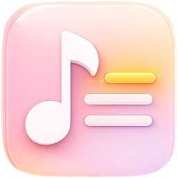
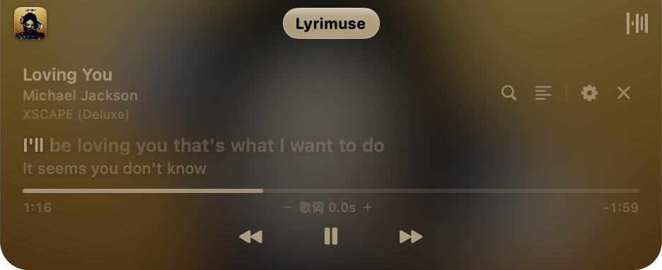

<div align="center">



# Lyrimuse

**跟着 Apple Music 播放，在 Mac 桌面上实时显示逐字同步歌词。**

**语言 / Language:** [English](README.md) | **简体中文**


</div>

Lyrimuse 常驻在菜单栏里，跟着 Apple Music 播放弹出一个悬浮歌词窗口——逐字同步、常驻置顶、跨 Space 显示。就是网易云音乐、QQ 音乐桌面客户端那种"桌面歌词"体验，只不过是原生 macOS 版本。

<div align="center">

<br>
<sub>经典悬浮窗</sub>

<br>
<sub>灵动岛样式胶囊（没有物理刘海也能用）</sub>

</div>

## 功能特性

### 歌词，做到位
- **逐字同步高亮**，跟随播放进度实时显示
- **自动查四个歌词源**——网易云音乐、QQ 音乐、酷狗、LRCLIB——自动挑出最合适的一份，不用自己动手搜
- **罗马音 + 翻译**，跟原文一起显示
- **完整的「歌词管理」窗口**——浏览、手改、删除、重新搜索任意一首歌的歌词，遇到不同步还能单独调整这首歌的时间轴偏移
- **本地模式完全离线**——已经缓存好的歌词不需要联网也能显示

### 想怎么看，你说了算
- **两种悬浮样式**：经典桌面悬浮窗，或者贴着屏幕顶部刘海的灵动岛胶囊——开一个、都开、或者都不开
- **菜单栏文字模式**——不想要悬浮窗，直接在状态栏看当前这一行歌词
- **悬浮窗自带播放控制**（播放/暂停、上一首、下一首）
- **外观完全自定义**：字体（也可以跟随系统）、字号、文字/背景/阴影颜色（可以存成配色主题反复用）、悬浮窗宽度、位置锁定
- **截屏/录屏/共享屏幕时自动隐藏**——只有你自己在这台 Mac 上还能看见
- **暂停时自动收起**，不会占着桌面空转

### 一个懂事的 Mac 应用该有的样子
- **中英文界面**，切换立即生效，不用重启
- **全局快捷键**，覆盖每一个常用动作，默认都不绑定任何按键，交给你自己决定
- **只待在菜单栏里**，不占 Dock（想显示在 Dock 里也可以在设置里打开）

### 附加功能（可选）
以下全部默认关闭、按需开启，都在设置里配置：

- **同步播放记录到 [ListenBrainz](https://listenbrainz.org)**，和/或 **Last.fm**（一键连接 Last.fm 账号，不用自己手动换 token）
- **把 iPhone 上的播放记录桥接进来**（经 Last.fm），跟 Mac 上的播放记录合并成一份完整历史
- **一个可以到处分享的"正在听什么"网页**——实时播放状态、历史播放、留言墙、表情反应、访客计数、历史 Top10 歌手榜单、黑胶唱片视觉效果、深浅色主题，分享到聊天工具里还会自动展开预览卡片。完整效果展示 + 从零搭建教程见 **[网页玩法教程](docs/web-features.zh-CN.md)**。
- **每周听歌小结**，通过推送通知发给你（支持 Bark、钉钉、企业微信、Discord、飞书、Server酱）

以上每一项都在设置的「附加功能」里配置，每张账号卡片自带完整的分步引导——去哪申请 API Key/Token、怎么连接账号、怎么给选定的推送平台拿到 Webhook 地址，点开对应卡片就有。唯一的例外是网页展示页，它需要先自己部署一份 Cloudflare Worker，所以单独写了一份教程，而不是塞进设置里的一个小弹窗。

## 快速开始

Lyrimuse 目前还没有做成签名发行版——需要自己构建，不需要 Apple 开发者账号（ad-hoc 签名即可）。需要装 Xcode 的 Command Line Tools（跑 Swift）和 Go 工具链——`build.sh` 会一次性把 App 和它的后台采集器都构建好。

```bash
git clone git@github.com:Yudaotor/lyrimuse.git
cd lyrimuse/lyrimuse
./build.sh
```

从 `/Applications` 打开 Lyrimuse——首次启动的引导向导会带你完成它真正需要的两件事：允许它以「自动化」方式读取 Music.app 当前播放的歌曲信息，以及启用它的后台常驻采集服务（这样就算把窗口关掉，歌词/封面也会持续解析）。两步都完成后歌词马上就会显示出来（更多构建选项见 [lyrimuse/README.md](lyrimuse/README.md)）。

不需要再配置任何其它东西才能看到歌词——上面提到的所有附加功能都是后续在设置里按需开启的。

## 仓库里还有什么

- [`lyrimuse/`](lyrimuse) —— App 本体（Swift，SwiftUI + AppKit）
- [`lyrimuse-collector/`](lyrimuse-collector) —— 后台引擎，负责解析歌词/封面并喂给 App（Go）
- [`state-worker/`](state-worker)、[`badge-worker/`](badge-worker)、[`worker/`](worker) —— 上面网页功能背后可选的 Cloudflare Worker
- [`docs/web-features.zh-CN.md`](docs/web-features.zh-CN.md) —— 网页展示页的完整教程，带真机截图和从零搭建步骤

## 致谢

灵动岛样式悬浮歌词窗口的设计和技术思路参考了 [boring.notch](https://github.com/TheBoredTeam/boring.notch)、[NotchDrop](https://github.com/Lakr233/NotchDrop) 和 [DynamicNotchKit](https://github.com/MrKai77/DynamicNotchKit)；桌面歌词这个概念本身则要归功于 [LyricsX](https://github.com/ddddxxx/LyricsX)。
