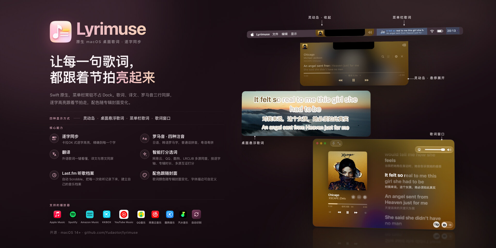

<div align="center">


# Lyrimuse

**桌面歌词，为 Mac 全新构想。**

**语言 / Language:** [English](README.md) | **简体中文** | [繁體中文](README.zh-Hant.md)


[](https://github.com/Yudaotor/lyrimuse/releases/latest)
[](https://github.com/Yudaotor/lyrimuse/commits/dev)
[](LICENSE)

</div>

https://github.com/user-attachments/assets/ba9dc7d8-1a7f-4dc5-b346-bfe9d48c9e24

Lyrimuse 是一款开源的 Mac 桌面歌词软件。它待在菜单栏里，跟随播放逐字高亮歌词，可以常驻置顶、悬浮在所有窗口之上，也可以放进菜单栏、刘海下的灵动岛胶囊或完整的歌词窗口。支持 Apple Music、Spotify、QQ 音乐、网易云音乐等八款播放器和浏览器里的网页播放器，并从十二个歌词源中打分挑选最合适的版本，还能显示翻译和读音。另外还内置 Last.fm 听歌档案和打卡。

**从 LyricsX 过来？** LyricsX 自 2022 年 4 月后就没有再发布新版本。Lyrimuse 覆盖了它的核心功能并持续更新，还补上了国内播放器、KKBOX、Amazon Music 和网页播放器的支持。详细差异见这份逐项核实过的[与 LyricsX、Lyric Fever 的对比](docs/lyrics-apps-comparison.zh-CN.md)。

**安装：** 推荐用 Homebrew，Apple Silicon 和 Intel 通用，还会顺手处理首次打开时的 Gatekeeper 拦截。想手动安装，可以从[最新 Release](https://github.com/Yudaotor/lyrimuse/releases/latest) 下载，步骤见[快速开始](#快速开始)。

```bash
brew tap yudaotor/lyrimuse
brew trust --cask yudaotor/lyrimuse/lyrimuse   # 只需一次：Homebrew 要求先信任非官方 tap
brew install --cask lyrimuse
```


<p align="center"><sub>四种显示方式：歌词窗口、灵动岛胶囊、逐字染色的桌面悬浮歌词、菜单栏歌词</sub></p>


<p align="center"><sub>歌词管理、给每个结果都打了分的手动搜索，还有一个面板告诉你这首歌为什么用了这份歌词</sub></p>


<p align="center"><sub>Last.fm 数据和榜单、没在放歌时的听歌总览，还有一张 GitHub 那样的全年热力图</sub></p>


<p align="center"><sub>每一页设置都能实时预览，播放器可以多选（网页播放器也行），其余常用操作都在菜单栏下拉里</sub></p>

## 功能特性

### 逐字同步歌词，自动匹配对的版本
- **逐字高亮**，跟着歌一起走。
- **十二个歌词源，自动帮你查**：网易云音乐、QQ 音乐、酷狗、酷我、咪咕、Musixmatch、LRCLIB、LyricFind（经 YouTube Music）、Deezer、AMLL（人工校对的逐字歌词库）、汽水音乐（官方逐字）、Apple Music 自己的歌词（在设置里连上账号才有）。Apple Music 是其中唯一的官方来源，很多歌还带逐字时间轴。你不用自己去搜。
- **翻译和读音**显示在原文下面。歌词源自带社区翻译就用它的；没有的话，由你的 Mac 用 Apple 系统翻译来翻，歌词不出本机，本机翻不了再用联网翻译兜底。译文有 17 种语言可选。读音是一行一行判断的：中文歌里夹了一句日文，就只给那一句标读音，不会给整首歌标上拼音；粤语歌会按词标粤拼。
- **对唱按歌手分开显示**。只要歌词源（或 AMLL）标了哪句是谁唱的，两个人的词就不会挤成一团。
- **歌词窗口里有 Apple Music 那些细节**：和声单独一行放在主句下面，对唱里重叠的两句一起亮到唱完，英文拖长音的词会像 Apple Music 那样放大、发光。
- **歌词可以单独切简体或繁体**，跟 App 界面用什么语言无关。
- **「歌词管理」窗口**，用来收拾歌词：浏览、手改、删除、重新搜索任意一首，可以多选批量删，列宽也能拖。某首歌时间对不上，可以单独给它调偏移。还没找到歌词的歌可以一键全部重试，整个曲库也能按现在的匹配规则重新挑一遍，你手改过的不会被动。
- **离线也能看**：缓存过的歌词不联网也能显示。

### Last.fm 听歌档案与打卡
- **一份完整的听歌档案**。在设置的「账号」里一键连上 Last.fm（不用自己复制 token），就能看到今天、近 7 天和一共听了多少，一行实时的「正在记录」提示，还有带封面的最近播放，每一首都能点红心，在 Last.fm 上标喜欢或者取消。默认按 Last.fm 曲库里的正式条目上送，合唱署名、简繁写法、「- Single」「(Remastered)」这类尾巴都会对齐到真实的歌曲页；想完全原样发送，可以在设置里切到「原始」。ListenBrainz 始终原样发送（[打卡规则详解](docs/scrobbling.zh-CN.md)）。
- **歌手、专辑、歌曲榜单**，可以看近 7 天、近 30 天、近一年或全部，每一项都标出比上一期升了还是降了。点开一个歌手，能看到你最常听他的哪几首。
- **「足迹」**，单独一个分页。最上面是一本总账：从第一次打卡算起的第几天、有记录的天数和日均、单日最多、当前和最长的连续天数、今年到现在跟往年同期比，还有离下一个整数里程碑差多少。下面依次是 GitHub 那样的全年热力图、按小时和星期几统计的收听时段、常听歌手来自哪些国家和地区，最后是「那年今日」，看看往年的今天你在听什么。
- **每次播放都先记在本地**，还没连 Last.fm 也照记。以后连上，中间这段会自动补传。
- **听到多少才算一次，你来定**：按 Last.fm 默认的 50%，或者 75%、90%，或者整首放完才算（ListenBrainz 不受影响）。也可以把某个播放器整个排除在 Last.fm 外面，它放的歌就不会进你的记录。
- **这份记录在歌词窗口里也看得到**：没在放歌的时候，窗口会显示听歌总览，而不是一片空白（后面细说）。

### 桌面悬浮歌词、菜单栏歌词、灵动岛、完整歌词窗口
- **播放器可以多选，也可以自动识别**。Apple Music 和 Spotify 通过「自动化」权限读取；QQ 音乐、网易云音乐、酷狗音乐、汽水音乐、KKBOX、Amazon Music 走 macOS 的 MediaRemote，不需要权限。在设置里随便组合，或者留在自动识别，macOS 显示哪个在「正在播放」就跟哪个。
- **Apple Music 电台也能用**。电台里每首歌的歌词都跟得上；主播说话的时候显示电台名和台标，不会停在上一首。电台有自己的时间偏移，常听的台调一次就好。
- **浏览器里的播放器也能用**。把常用的浏览器配对一次，YouTube Music 或 Spotify 网页版就跟别的播放器一样，歌词按网页自己的进度条走。有个一键自检，能先告诉你这个浏览器到底能不能被控制。放广告时灵动岛会变黑，显示还剩多久、这是第几条广告；YouTube Music 的广告还会出一个跳过按钮，也可以设成自动跳过。
- **怎么显示，你来选**（可以同时开好几种，也可以都不开）：
  - 桌面悬浮歌词：拖到哪儿就停在哪儿，也可以固定在屏幕顶部居中，或者 Dock 上方居中；
  - 灵动岛胶囊：贴在屏幕顶部，可以显示专辑封面，还能把封面模糊后铺在背景里；
  - 歌词窗口：照着 Apple Music 歌词页做的，大小可调，左右两栏，模糊的封面铺底，整首歌词跟着滚到当前这句；Apple Music 有动态封面的专辑，封面也会动。
- **菜单栏歌词（文字模式）**：当前这句直接显示在菜单栏上。句子太长会滚动显示，不会截成半句（想截断也可以改回去）。还能多加一行，显示下一句、译文或读音，灵动岛胶囊也可以这样。
- **拖进度条就能跳**，歌词窗口和灵动岛上都行。
- **一键打开这首歌的页面**：在「⋯」菜单或简介面板里点一下。Apple Music 直接在 App 里打开，Spotify 跳到正在放的这首，QQ 音乐和网易云音乐打开歌曲、专辑或歌手的网页。链接在查歌词的时候就找好了，不用再搜。
- **没在放歌的时候**，歌词窗口会显示今天和本周听了多少、「那年今日」，还有一份带封面的最近播放，点一下就跳到 Apple Music 里对应的专辑或歌手页。
- **迷你歌词窗口**：一张小卡片，只放当前句和下一句，可以选简洁或多行，背景、文字颜色和字体都单独调。
- **专辑介绍和歌手简介**：在歌词窗口或展开的灵动岛上点歌手名、专辑名就能看，内容来自 Apple Music，Apple Music 没有时用 Last.fm 的。
- **外观随你改**：字体（跟随系统，或者导入自己的 .ttf / .otf）、字号、文字 / 背景 / 阴影颜色（可以存成主题，也可以让文字颜色跟着专辑封面变）、悬浮窗宽度。
- **截屏、录屏、共享屏幕时自动隐藏**，你自己照样看得见，别人看不到。
- **暂停时自动收起**，不会一直占着桌面。

### 日常用起来的细节
- **简体中文、繁体中文、英文界面**，切换马上生效，不用重启。
- **全局快捷键**，每个常用操作都能绑，默认一个键都不占，用哪个你自己定。
- **设置可以搜**：在侧栏里打字，会直接滚到对应那一项并高亮，藏在折叠区里的也会自己展开。
- **自动更新**：它会自己检查（也可以在菜单栏里手动查），在设置的「软件更新」页里安装，更新说明和进度都在那一页。想尝鲜可以打开「接收测试版更新」。
- **跟播放器一起启动**，每个播放器单独设置，两个方向都行：打开 Lyrimuse 时顺便打开播放器，打开播放器时顺便打开 Lyrimuse；还可以在它跟着的播放器都退出以后，自己也退出。
- **换新 Mac**：把整套设置导出，再到新机器上导入就行。出了问题还能一键导出诊断信息。

### 附加功能（可选）

<details>
<summary>ListenBrainz 同步、可分享的「正在听什么」网页、日报 / 周报 / 月报 / 年度小结</summary>

下面这些默认都关着，想用哪个就在设置里打开哪个：

- **同时同步到 [ListenBrainz](https://listenbrainz.org)**。每次播放都用同一份读到的播放状态，分别发给 Last.fm 和 ListenBrainz，两边的记录不会对不上。iPhone 上经 Last.fm 记下的播放也会自动转进 ListenBrainz，Mac 和 iPhone 的记录就合成了一份。
- **一个能分享出去的「正在听什么」网页**：实时播放、历史记录、留言墙、表情回应、访客计数、Top10 歌手榜、黑胶唱片效果、深浅色主题，发到聊天软件里还会展开成预览卡片。效果展示和从零搭建的步骤见 **[网页玩法教程](https://github.com/Yudaotor/nowplaying-workers#readme)**。
- **日报、周报、月报和年度听歌小结**，通过推送发给你（Bark、钉钉、企业微信、Discord、飞书、Server酱、Telegram 都支持）。

这些都在设置的「附加功能」里，每张卡片都带分步说明：去哪申请 API Key 或 Token、怎么连账号、怎么拿到推送平台的 Webhook 地址。只有网页那项单独写了一份教程，而且也不是非搭不可：只配好 ListenBrainz，网页就已经能显示实时播放和历史，不用部署 Cloudflare Worker。想要留言墙、表情回应、访客计数、Top10 歌手榜和更快的刷新，再照着教程部署一个。

</details>

## 快速开始

Lyrimuse 的发布包用的是项目自己的签名证书，不是 Apple 开发者 ID，所以下面哪种装法都用不到 Apple 开发者账号。代价是第一次打开时，Gatekeeper 会提示「来自身份不明的开发者」。用 Homebrew 装（方案 A）会自动处理掉；用其它方式装的话，看到这个提示是正常的，不是 bug，方案 B 里写了怎么一次性解决。
### 方案 0：把安装丢给 AI

如果你的 Mac 上跑着能执行终端命令的 AI 助手（Claude Code、Codex CLI、Gemini CLI 等），把下面这段话**原样**贴给它，方案 A/B 的所有步骤它都会替你做完。这段话只允许它装这一个应用，全程不用 `sudo`，也不碰系统级安全设置：

```text
请在这台 Mac 上安装 Lyrimuse——一个开源的 macOS 菜单栏歌词应用
（https://github.com/Yudaotor/lyrimuse），严格按以下规则执行：

1. 首选路径（如果有 `brew`）：
     brew tap yudaotor/lyrimuse
     brew trust --cask yudaotor/lyrimuse/lyrimuse
     brew install --cask lyrimuse
   如果这台机器的 Homebrew 没有 trust 子命令，跳过那一行——旧版本不需要。
2. 没装 Homebrew 的话，不要替我安装 Homebrew。改走手动路径：先用 `uname -m`
   确认芯片架构，去 https://github.com/Yudaotor/lyrimuse/releases 下载最新版本
   对应的文件——arm64 下 `Lyrimuse-v<版本>-macos.zip`，x86_64 下
   `Lyrimuse-v<版本>-macos-intel.zip`——用同处提供的 `.sha256` 文件校验
   （`shasum -c`），解压后把 `Lyrimuse.app` 移进 /Applications，然后只对这
   一个 app 清除 Gatekeeper 隔离标记：
     xattr -dr com.apple.quarantine /Applications/Lyrimuse.app
3. 安全红线：全程不用 `sudo`（这里没有任何一步需要它）；绝不执行
   `spctl --master-disable` 或任何全局关闭 Gatekeeper 的操作；除
   /Applications/Lyrimuse.app 外不得对任何东西清除隔离标记。
4. 除非我明确要求，不要从源码构建。
5. 启动它（`open -a Lyrimuse`），并确认在运行（`pgrep -x Lyrimuse` 能打出 PID）。
6. 首次启动会弹出引导向导——那部分由我自己点：告诉我它会让我选播放器、
   （只在选了 Apple Music 或 Spotify 时）授权对它们的「自动化」访问、以及启用
   歌词引擎，然后把控制权交还给我。
最后用中文汇报你做了什么、有没有失败的步骤。
```

### 方案 A：用 Homebrew 安装（推荐）

```bash
brew tap yudaotor/lyrimuse
brew trust --cask yudaotor/lyrimuse/lyrimuse   # 只需一次：Homebrew 要求先信任非官方 tap
brew install --cask lyrimuse
```

安装过程中会自动清掉这次的 Gatekeeper 隔离标记，不需要额外操作。`brew install` 跑完，直接从 `/Applications`（或者 Spotlight）打开 Lyrimuse 就行。以后有新版本，`brew upgrade --cask lyrimuse` 同样能自动处理。

### 方案 B：手动下载预编译版本

1. 去 [Releases 页面](https://github.com/Yudaotor/lyrimuse/releases) 下载。**先看清自己是哪种 Mac**（左上角  → 关于本机 →「芯片」：`Apple M…` 是 Apple Silicon，`Intel Core…` 是 Intel）：

   | 你的 Mac | 下这份 |
   | --- | --- |
   | Apple Silicon（M1 及以后） | `Lyrimuse-*-macos.dmg` 或 `.zip` |
   | Intel | `Lyrimuse-*-macos-intel.dmg` 或 `.zip` |

   dmg 双击挂载后把 `Lyrimuse.app` 拖到旁边的 `Applications` 上；zip 解压后把 `Lyrimuse.app` 拖进 `/Applications`。两种格式装出来完全是同一个 App，zip 还附带一份 `.sha256`，想核对下载完整性就在同一目录里跑 `shasum -c Lyrimuse-*.zip.sha256`。

   两份的区别只在架构：不带后缀的那份是纯 Apple Silicon，`-intel` 那份同时含 Intel 和 Apple Silicon 两套代码。`-intel` 也能在 Apple Silicon 上跑，但没必要：体积大一倍，而且 macOS 27 及以后会因为它含 Intel 代码而提示「需要更新 App」（Apple 要在 macOS 28 移除 Rosetta；App 本身没问题）。

   **两种架构都有 App 内自动更新。** 更新源里为同一个版本登记了两条，各自对应一种架构：Apple Silicon 收到不带后缀的那份，Intel 收到 `-intel` 那份，Sparkle 按机器自己挑，你不用管。（v1.4.0 及更早只服务 Apple Silicon，Intel 用户当时得回这个页面手动下。）

   **中国大陆下载加速：** GitHub 直连慢或超时的话，给下载地址加一个公共加速前缀即可，例如把 Releases 页复制出来的链接改成 `https://ghfast.top/https://github.com/Yudaotor/lyrimuse/releases/download/…`。镜像域名可能会失效，失效了就换一个可用的 gh-proxy 类前缀（用法相同，都是原链接前面加前缀），下载后照常用 `.sha256` 校验。
2. 第一次打开时 macOS 会拒绝运行，提示"Lyrimuse 已损坏，无法打开"或"来自身份不明的开发者"。用下面任意一种方式解锁一次即可：

   - **终端命令（推荐，永远有效）：**
     ```bash
     xattr -dr com.apple.quarantine /Applications/Lyrimuse.app
     ```
     然后正常打开即可，每份下载只需要做一次。
   - **右键 → 打开：** 在 Finder 里右键（或 Control-点击）`Lyrimuse.app`，选择"打开"，弹窗里再确认一次"打开"。不是每个 macOS 版本、每种提示都能用这招，不行的话回退用上面的终端命令。
   - **系统设置 → 隐私与安全性：** 先试着打开一次（会被拦下），再打开**系统设置 → 隐私与安全性**，滚到最底部，点 Lyrimuse 警告旁边的"仍要打开"，弹窗里再确认一次。

   只对你真正信任的构建版本执行这几条命令，比如这个仓库自己 Releases 页面下的，或者你自己构建的那份。

### 方案 C：自己构建

**一次性前置依赖**（已经装过的可以跳过）：

```bash
xcode-select --install   # Xcode 的 Command Line Tools，跑 Swift 用——`swift --version` 能跑就说明已经装过
brew install go          # 任意 ≥1.21 的 Go 都行——build.sh 会通过 GOTOOLCHAIN 自动切到 1.24.4
```

装好之后，`build.sh` 会一次性把 App 和它的后台采集器都构建好：

```bash
git clone https://github.com/Yudaotor/lyrimuse.git
cd lyrimuse/lyrimuse
./build.sh               # 编当前这台机器的架构
./build.sh --universal   # 编 arm64 + x86_64 的 universal 包(给 Intel 用的那份兼容包)
```

`build.sh` 最后会把包里每个二进制的架构列出来，跟目标不符（缺一半、或多带了一份）都会报出来。发布资产不要手工打，用 `./package.sh`，它自己会把两种架构各构建一次、各出一套 zip + sha256 + dmg，架构不符直接拒绝打包。

QQ 音乐/网易云音乐/酷狗音乐/汽水音乐/KKBOX/Amazon Music/Spotify/自动识别这几个播放源支持额外需要 [ungive/media-control](https://github.com/ungive/media-control)。本机没装的话 `build.sh` 会自动用 Homebrew 装一次，这一步也不需要你自己动手。

### 不管选哪种方案

从 `/Applications` 打开 Lyrimuse，首次启动的引导向导会带你完成：选一个播放器（Apple Music、QQ 音乐、网易云音乐、酷狗音乐、汽水音乐、KKBOX、Amazon Music、Spotify，或者自动识别），选了 Apple Music 或 Spotify 的话再授予对它的「自动化」权限（其它几个都不需要额外权限），以及启用它的歌词引擎（在后台常驻，这样就算把窗口关掉，歌词/封面也会持续解析）。走完引导歌词马上就会显示出来（更多构建选项见 [lyrimuse/README.md](lyrimuse/README.md)）。

看歌词只需要这些。上面那些附加功能，以后想用了再去设置里打开就行。

## 常见问题

### Mac 上怎么让 Apple Music 的歌词悬浮在桌面、一直置顶？
在设置里打开桌面悬浮歌词就行。它浮在所有窗口上面，切换桌面也跟着。可以拖到任意位置，也可以固定在屏幕顶部居中，或者 Dock 上方居中。歌词带逐字时间轴的话，唱到哪个字就亮到哪个字。截屏、录屏和共享屏幕时可以让它只有你自己看得见，暂停时也能自动收起。QQ 音乐、网易云音乐、酷狗音乐、汽水音乐、KKBOX、Amazon Music、Spotify 和网页播放器也都一样。

### Spotify 的歌词能显示在 Mac 菜单栏上吗？
能。打开菜单栏文字模式，当前这句歌词就显示在菜单栏上，Spotify 和其它支持的播放器都可以。句子太长会滚动，不会被截断；还能多加一行，显示下一句、译文或读音。不用登录 Spotify 账号。Lyrimuse 会请求一次控制 Spotify 的「自动化」权限，有了它进度才精确，播放按钮也才能用；不给的话歌词照样显示，只是进度改从 macOS 的 MediaRemote 读，可能差一秒左右。

### QQ 音乐、网易云、酷狗、汽水音乐能显示逐字歌词吗？
能，只要歌词本身带逐字时间轴。网易云、QQ 音乐、酷狗、汽水音乐、Musixmatch、AMLL 和 Apple Music 的歌词大多有，这些会一个字一个字地亮；只有逐行时间的就整行亮。用哪个播放器听，也不影响去哪儿找歌词：在汽水音乐里放的歌，如果 QQ 音乐那份逐字歌词分最高，最后用的就是它。

### 装这个需要 Apple 开发者账号吗？
不需要。发布包用的是项目自己的签名证书，不是 Apple 开发者 ID，你不需要开发者账号，这个项目也没有。第一次打开要过一下 Gatekeeper 也是这个原因，见上面的「快速开始」。

### Mac App Store 上有吗？
没有。用 Homebrew 装（上面的方案 A），或者去 [Releases 页面](https://github.com/Yudaotor/lyrimuse/releases) 下载（方案 B）。不管哪种，之后的更新都在 App 里完成。

### Lyrimuse 免费吗？
免费。它是 GPL-3.0 开源的，没有付费版，没有内购，也不用注册账号。Last.fm 这些账号连不连都随你。

### 只支持 Apple Music 吗，Spotify、QQ 音乐、网易云音乐能用吗？
都能用，另外还有酷狗音乐、汽水音乐、KKBOX 和 Amazon Music，一共八个播放器；也可以交给自动识别，macOS 显示哪个在「正在播放」就跟哪个。Apple Music 和 Spotify 需要「自动化」权限（Spotify 用它拿精确进度、控制播放），其它六个走 macOS 的 MediaRemote，不需要任何权限。用 KKBOX 或 Amazon Music 放歌时，它们自己存下的这首歌词也会拿来比较，Lyrimuse 不会向这两家发任何请求。

### KKBOX、Amazon Music 在 Mac 上能显示桌面歌词吗？
能。这两家都通过 macOS 的 MediaRemote 读取，不用给权限，歌词和其它播放器一样能显示在桌面悬浮窗、菜单栏、灵动岛胶囊和歌词窗口里。如果 KKBOX 或 Amazon Music 自己已经存了这首歌的歌词，也会拿来一起比较，并且额外加分。Lyrimuse 不登录这两家的账号，也不向它们发请求。其它歌词源照样会查，哪家的版本更好（比如带逐字时间轴），就用哪家的。

### Mac 桌面歌词是什么效果？
就像桌面上的卡拉 OK。当前这句浮在所有窗口上面，歌词带逐字时间轴的话，唱到哪个字就亮到哪个字，需要的话译文或读音跟在原文旁边。字体、字号、文字 / 背景 / 阴影颜色和宽度都能调，文字颜色还可以跟着专辑封面变。同样的歌词也能放进菜单栏、刘海下的灵动岛胶囊，或者一个仿 Apple Music 的完整歌词窗口，几种可以同时开。

### 没有刘海的 Mac 也能用灵动岛胶囊吗？
能。在没有刘海的屏幕上（比如老款 MacBook 或外接显示器），胶囊会贴在屏幕顶部居中，跟菜单栏一样高。放在哪块屏幕上，可以在设置里选。

### 没有网络能看歌词吗？
找过一次歌词的歌就能看，歌词已经缓存在你的 Mac 上了。第一次给一首歌找歌词，还有联网翻译，都需要网络。

### 我的数据会传到外面吗？
找歌词时，得把正在放的这首歌拿去问各个歌词源：网易云、QQ、酷狗、酷我、咪咕、Musixmatch、LRCLIB、LyricFind、Deezer、AMLL、汽水音乐，连了账号的话还有 Apple Music。封面从 iTunes Search 查。翻译默认在本机完成，只有本机翻不了时，才会把歌词文本发给联网翻译（先 Google 网页翻译，再 MyMemory）。你的听歌记录、缓存的歌词和设置都存在你 Mac 上的文件里，除非你自己连上 Last.fm、ListenBrainz 或那个可选的网页中继。完整清单见下面的「[许可与版权说明](#许可与版权说明)」。

### 能标日语/韩语读音，或者翻中文吗？
能。读音是一行一行判断的，几种语言混着唱的歌，只会在该标的行上标。翻译优先用歌词源自带的社区翻译，没有就用本机或联网的机器翻译，可以翻成 17 种语言。

### 支持哪些 macOS 版本？
macOS 14 Sonoma 及以上（Sequoia、Tahoe 以及更新的版本都行），Apple Silicon 和 Intel 都支持。要在本机翻译，需要 macOS 15 Sequoia 及以上，更早的系统只能用联网翻译。

### 支持 Intel Mac 吗？
支持，用单独的 universal 包（见上面方案 B）。从 v1.5.0 起，Intel 版也能在 App 里自动更新，有新版本时跟 Apple Silicon 一样会提示你。

### 浏览器里放的 YouTube Music / Spotify 网页版能出歌词吗？
能。在设置里把常用的浏览器配对一次，YouTube Music 或 Spotify 网页版就能像别的播放器一样用。歌词跟着网页自己的进度条走，不是估出来的；配对之前还能一键自检，先看看这个浏览器能不能被控制。

### Mac 上能把 Apple Music 的听歌记录同步到 Last.fm 吗？
能，这是它除了歌词之外的另一半。在设置里一键连上 Last.fm，Apple Music（以及其它支持的播放器）的每次播放都会打卡，还会实时显示「正在播放」。每次播放都先记在本地，所以连上之前听的歌也不会丢，连上以后会补传。听到多少算一次可以选 50%、75%、90% 或者整首放完，某些播放器可以排除在外，也可以同时提交到 ListenBrainz。

### 怎么保证匹配到的歌词是对的？
它不会哪个源先返回就用哪个。所有源返回的结果放在一起，按同一套标准打分：歌名、歌手、专辑、时长对不对得上，再加上有没有逐字时间轴这类质量因素，分最高的胜出。每首歌都能看到这个过程：有个面板列出每份候选的得分，以及最后那份为什么胜出。之后要是某个源出了更干净、更完整的版本，Lyrimuse 可以自动换过去；你亲手选的歌词会被锁定，不会被自动替换。手动搜索里也显示同样的分数和标注，选错版本一眼就能看出来。

### 歌词不同步或者找错了怎么办？
时间对不上，就给这首歌调个偏移，以后再放这首都会记住。歌词不对或者版本不对，就打开手动搜索，所有歌词源的结果连同分数都列在那儿；你选中的那份会被锁定，自动匹配不会再换掉它。任何一首歌的歌词也都能在「歌词管理」里自己改。

### 能把歌词存成 .lrc 文件吗？
本来就存着。每首找到歌词的歌都有一份逐行时间的 `.lrc`；有译文、读音的，另外还有 `.tr.lrc` 和 `.roma.lrc`。逐字时间轴单独存成 `.yrc`，用的是网易云的 YRC 格式，大多数别的播放器读不了。文件放在 `~/.config/lyrimuse/lyrics/`，位置可以在设置里改。

### LyricsX 还在维护吗？Lyrimuse 和 LyricsX、Lyric Fever 有什么区别？
LyricsX 最后一个版本是 2022 年 4 月的 v1.6.3，支持 macOS 10.11 及以上，能配合 Apple Music、Spotify 和几个老牌播放器用。Lyric Fever 主要做 Spotify 和 Apple Music，需要 macOS 15 及以上。Lyrimuse 需要 macOS 14 及以上，另外支持 QQ 音乐、网易云音乐、酷狗、汽水音乐、KKBOX、Amazon Music 和浏览器里的播放器，能逐行标拼音、粤拼和日文假名，还能打卡到 Last.fm / ListenBrainz，并在本地统计你的听歌数据。逐项核实过的对照表见[对比页](docs/lyrics-apps-comparison.zh-CN.md)。
## 许可与版权说明

- **Lyrimuse 本身以 [GPL-3.0](LICENSE) 授权。** 随 App 一起分发的开源组件与词典数据（media-control、Sparkle、KeyboardShortcuts、OpenCC 与 rime-cantonese 词典）各自保留原许可证，全文见 [THIRD_PARTY_LICENSES](THIRD_PARTY_LICENSES)；这个文件也打进了 App 包里，**设置 → 关于 → 第三方许可**能直接打开。
- **歌词、封面与曲目信息的版权归各自的权利人所有。** Lyrimuse 只做检索、缓存与展示：公开歌词接口返回什么，就存在你自己 Mac 上的 `~/.config/lyrimuse/` 里给你自己看，不托管、不转发、不再分发任何歌词或封面；缓存随时可以在「歌词管理」里删，或者直接删掉那个文件夹。
- **Lyrimuse 是独立的开源项目**，与 Apple、腾讯（QQ 音乐）、网易（网易云音乐）、酷狗、酷我、抖音（汽水音乐）、KKBOX、Amazon（Amazon Music）、中国移动（咪咕音乐）、Spotify、Google（YouTube Music、Google 翻译）、Last.fm、ListenBrainz、MusicBrainz、Musixmatch、LRCLIB、LyricFind、Deezer、AMLL、SponsorBlock 均无隶属、合作或背书关系。这些名称和商标归各自所有者，这里提到它们只是为了说明支持哪些播放器、歌词来源和用到的服务。
- **会离开你 Mac 的只有这些。** 解析歌词时把歌手、歌名、专辑（部分源还带时长）发给上面十二个歌词源；全部落空时还会把歌手名发给 MusicBrainz 查别名（Last.fm 智能匹配遇到没见过的歌手时也会这样查）；榜单里的歌手也会按 MusicBrainz ID 去那里查国家/地区和相关链接。封面与空闲页把歌手加歌名发给 iTunes Search。专辑介绍和歌手简介按 Apple Music 的专辑 ID、歌手 ID 请求它们的公开页面，不需要登录 Apple 账号。机翻兜底（默认关，且只在端上 Apple 翻译不可用时）会把**歌词正文**分块先发给 Google 网页翻译，还没翻出来的再发给 MyMemory；发给 MyMemory 的请求附一个随机生成的邮箱参数，不是你的。YouTube Music 播 MV 时，会把视频 ID 的 SHA-256 哈希前 4 位发给 SponsorBlock，查出 MV 里不是音乐的片段、让歌词对上画面——SponsorBlock 凭这几位分辨不出是哪支视频。Musixmatch 的域名走 DNS over HTTPS，解析请求发给 Cloudflare（1.1.1.1）和 Google（8.8.8.8）。「关于」页最多每 6 小时向 GitHub API 查一次 Star 数，打开「测试版更新」后最多每小时查一次 Release 列表；检查更新只拉 GitHub Releases 上的 appcast，不上报系统信息。除此之外只有你主动连接的 Last.fm、ListenBrainz、推送平台和网页中继（中继的 Top10 歌手页会向 Deezer 查歌手头像）。每一条对外请求都记进本地审计日志（只记域名和操作名，不记参数和凭据），「导出诊断」里能看到。

## 排查

歌词不出来时，先在设置的「歌词来源」里点「测试」，看看是哪个源连不上。还解决不了的话，用「导出诊断」导出一份诊断信息，附在 [issue](https://github.com/Yudaotor/lyrimuse/issues) 里。诊断里已经带上了后台服务的完整自检结果。

<details>
<summary>命令行自检</summary>

同样的自检，也可以在终端里跑：

```sh
/Applications/Lyrimuse.app/Contents/Resources/collector healthcheck
/Applications/Lyrimuse.app/Contents/Resources/collector healthcheck -local-only  # 不联网
/Applications/Lyrimuse.app/Contents/Resources/collector healthcheck -json
```

</details>

## 卸载

把 `Lyrimuse.app` 拖进废纸篓**是不够的**。歌词引擎（进程名 `collector`）在 launchd 里注册的是 `KeepAlive`
类型的 job，它的 LaunchAgent 会留下来，于是 launchd 会一直去启动一个已经不存在的二进制。

```sh
lyrimuse/scripts/uninstall.sh              # 只看：报告当前装了什么
lyrimuse/scripts/uninstall.sh --services   # 注销两个 launchd job，数据一律保留
lyrimuse/scripts/uninstall.sh --purge      # 连配置、缓存、日志、偏好设置一起删
```

不带参数运行不会改动任何东西，只是告诉你系统里现在有什么。`--purge` 会先把要删的东西
逐个列出来、提醒你其中有多少个已导出的歌词文件，并且要求手动输入 `yes` 才继续。

`--services` 不碰偏好设置；`--purge` 会连偏好设置一起删（`defaults delete
me.yudaotor.lyrimuse`）。留着它会把重装引向一条死路：LaunchAgent 已经删了、collector
没装，而 App 仍然认为引导走完过——于是那扇能把服务装回去的引导页永远不出现，桌面就
一直停在「搜索歌词中…」。

## 项目结构

本仓库就是 App 本身：

- [`lyrimuse/`](lyrimuse) —— App 本体（Swift，SwiftUI + AppKit）
- [`lyrimuse-collector/`](lyrimuse-collector) —— 后台引擎，负责解析歌词/封面并喂给 App（Go）；构建时自动打包进 App

<details>
<summary>可选的网页体验：两个兄弟仓库</summary>

可选的网页体验拆在两个独立的兄弟仓库里，想 fork 哪个都不用碰 App：

| 仓库 | 角色 |
|---|---|
| [`Yudaotor/nowplaying`](https://github.com/Yudaotor/nowplaying) | 可分享的"正在听什么"网页本体，外带一份可直接 fork 的模板 |
| [`Yudaotor/nowplaying-workers`](https://github.com/Yudaotor/nowplaying-workers) | 网页背后的 Cloudflare Worker 中继 + 实时 README 徽章，配完整的从零搭建教程 |

```
本仓库 (App + 采集器)  ──推送──▶  nowplaying-workers (中继)  ◀──读取──  nowplaying (网页)
```

</details>

## 致谢

感谢 [LyricsX](https://github.com/ddddxxx/LyricsX)，它让人看到了 Mac 上的桌面歌词可以做成什么样。

<details>
<summary>Lyrimuse 用到的开源项目和社区数据</summary>

- [media-control](https://github.com/ungive/media-control) 与 [mediaremote-adapter](https://github.com/ungive/mediaremote-adapter)：读取 macOS 的「正在播放」
- [Sparkle](https://github.com/sparkle-project/Sparkle)：App 内更新
- [KeyboardShortcuts](https://github.com/sindresorhus/KeyboardShortcuts)：全局快捷键
- [OpenCC](https://github.com/BYVoid/OpenCC)：简繁转换
- [rime-cantonese](https://github.com/rime/rime-cantonese)：粤拼
- [AMLL TTML DB](https://github.com/amll-dev/amll-ttml-db)：社区校对的逐字歌词
- [LRCLIB](https://lrclib.net)：开放的同步歌词库
- [SponsorBlock](https://sponsor.ajay.app)：MV 里非音乐片段的标注

</details>

各自的许可证全文见 [THIRD_PARTY_LICENSES](THIRD_PARTY_LICENSES)。
