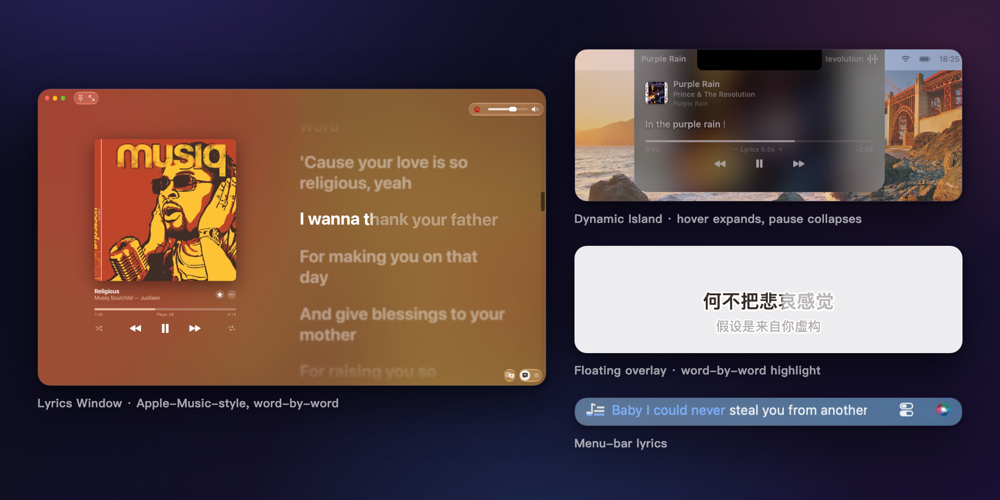
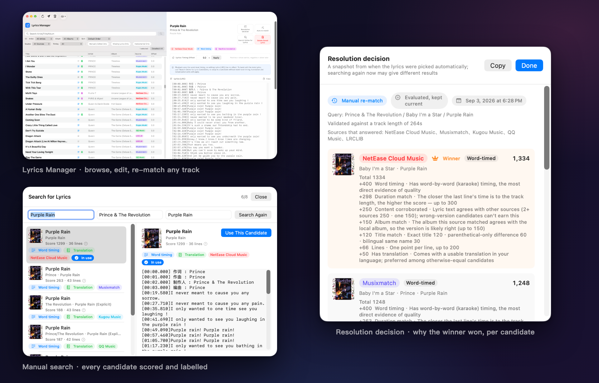
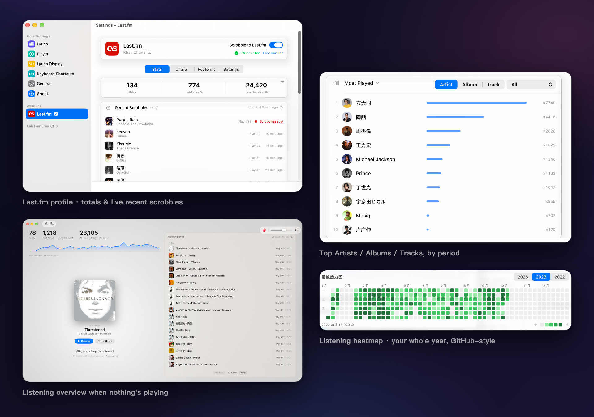
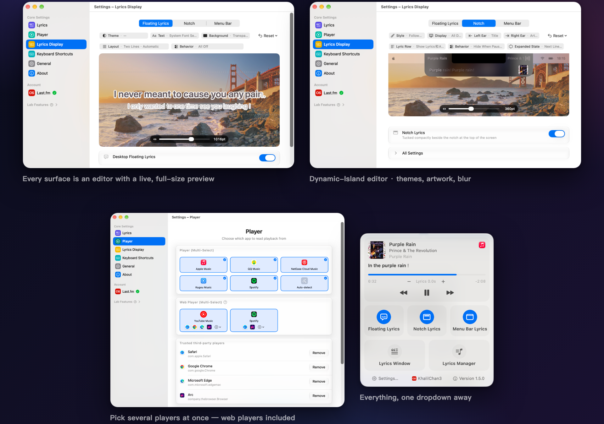

<div align="center">


# Lyrimuse

**跟著 Apple Music、QQ 音樂、網易雲音樂、酷狗音樂、Spotify，或瀏覽器裡的網頁版 YouTube Music / Spotify 播放，在 Mac 桌面上即時顯示逐字同步歌詞——外加 Last.fm 聆聽檔案和裝置端機器翻譯。**

**語言 / Language:** [English](README.md) | [简体中文](README.zh-CN.md) | **繁體中文**


[](LICENSE)

</div>

Lyrimuse 常駐在選單列裡，跟著目前播放彈出一個浮動歌詞視窗——Apple Music、QQ 音樂、網易雲音樂、酷狗音樂、Spotify，以及瀏覽器裡的網頁版 YouTube Music / Spotify，任選幾個組合（也可以交給自動偵測）——逐字同步、常駐最上層、跨 Space 顯示。就是網易雲音樂桌面用戶端那種「桌面歌詞」體驗，只不過是原生 macOS 版本。

**從 LyricsX 過來的？** LyricsX 自 2022 年 4 月起再沒發布過新版本。Lyrimuse 是一個持續維護的開源替代方案，**所有歌詞來源的候選統一評分、擇優勝出，專治配對到錯誤版本**，還額外涵蓋 QQ 音樂 / 網易雲 / 酷狗和瀏覽器網頁播放器——這裡有一份逐項查證過的[與 LyricsX、Lyric Fever 的對比](docs/lyrics-apps-comparison.zh-CN.md)（簡體中文）。

**安裝：** `brew tap yudaotor/lyrimuse && brew install --cask lyrimuse`（Apple Silicon 與 Intel 都支援；自動清掉一次性的 Gatekeeper 攔截）——或者到[最新 Release](https://github.com/Yudaotor/lyrimuse/releases/latest) 手動下載，詳見[快速開始](#快速開始)。


<p align="center"><sub>四種顯示形態——完整歌詞視窗、動態島樣式膠囊、經典桌面浮動歌詞（逐字填色）、選單列歌詞</sub></p>


<p align="center"><sub>歌詞引擎——歌詞管理、每個候選都有評分的手動搜尋、以及每首歌「贏家為什麼贏」的解析決策</sub></p>


<p align="center"><sub>聆聽檔案——Last.fm 數字與排行榜、沒有歌曲播放時的聆聽總覽、GitHub 風格的全年熱力圖</sub></p>


<p align="center"><sub>隨你自訂——每種形態都是帶即時預覽的編輯台、播放器可多選（網頁播放器也算數）、一切都在選單列一步之內</sub></p>

## 功能特色

### 歌詞，做到位
- **逐字同步填色**，跟隨播放進度即時顯示
- **自動查八個歌詞來源**——網易雲音樂、QQ 音樂、酷狗、酷我、Musixmatch、LRCLIB、LyricFind（經 YouTube Music）、AMLL（人工校對過的逐字歌詞庫）——自動挑出最合適的一份，不用自己動手搜尋
- **羅馬拼音 + 翻譯**，跟原文一起顯示——歌詞來源自帶社群翻譯時優先用它，沒有的話走裝置端機器翻譯（Apple 系統翻譯，歌詞不出本機），翻不了再退線上備用，譯文語言可選 18 種；羅馬拼音按行判斷，中日雙語歌只有日文行會標註讀音，不會連中文一起標上拼音；粵語歌自動標註粵拼（按詞消歧）
- **對唱／多人合唱歌詞分開顯示**，只要來源（或 AMLL 詞條）標出了是誰在唱哪一句，就不會把兩個人的聲部糊成一團
- **簡繁中文切換**，獨立於 App 介面語言，只管歌詞文字本身用哪種寫法
- **完整的「歌詞管理」視窗**——瀏覽、手動修改、刪除、重新搜尋任何一首歌的歌詞，支援多選批次刪除、欄寬隨手拖移，遇到不同步還能單獨調整這首歌的時間軸偏移
- **本機模式完全離線**——已經快取好的歌詞不需要連線也能顯示

### 你的聆聽檔案
- **一份真正的聆聽檔案，不只是同步播放記錄**——在主設定的「帳號」分類裡一鍵連線 Last.fm（不用自己手動換權杖），就能看到今天／近 7 天／總量數字、一行即時的「正在記錄」提示，還有帶封面的即時最近播放列表。送出時**播放器回報什麼就發什麼、原樣不動**，絕不在傳送前改寫歌手名或歌名（[Scrobble 規則詳解](docs/scrobbling.zh-CN.md)）
- **歌手／專輯／歌曲排行榜**，可按時段篩選（近 7 天／近 30 天／近一年／全部），外加「足跡」——本機聆聽足跡與「那年今日」回顧
- **每次播放都會先記在本機**，就算你還沒連 Last.fm——之後連上，之前累積的記錄會透過補傳佇列自動補上
- **這份本機記錄同樣會出現在歌詞視窗裡**——沒有歌曲播放的時候，它會變成一塊聆聽總覽面板，而不是一片空白（下面還會細說）

### 想怎麼看，你說了算
- **播放器可多選，或者交給自動偵測**：讀取 Apple Music（走「自動化」權限）、QQ 音樂、網易雲音樂、酷狗音樂或 Spotify（都走 macOS 系統級 MediaRemote，不需要任何權限）的播放狀態——在設定裡任意組合勾選，也可以直接留在自動偵測，跟隨 macOS 目前系統級 Now Playing 焦點
- **網頁播放器也是正規播放器**：配對一次你常用的瀏覽器，網頁版 YouTube Music 或 Spotify 就能當播放器用——歌詞按頁面自己的進度列精確同步，還有一鍵自我檢測告訴你瀏覽器到底能不能被驅動
- **三種展示方式**：經典桌面浮動視窗、貼著螢幕頂部瀏海的動態島膠囊（可選顯示專輯封面，背景也能跟著封面模糊），或者一個仿 Apple Music 歌詞頁、可縮放的「歌詞視窗」——雙欄版面、封面模糊鋪底、完整歌詞自動捲動到目前這一行——任意組合開啟，或者都不開
- **選單列文字模式**——不想要浮動視窗，直接在狀態列看目前這一行歌詞；太長的句子會橫向捲動播完，而不是截成半句（想要截斷也留著開關）
- **進度列拖著就能跳**——歌詞視窗和動態島的進度列都能拖移跳轉，不只是給你看進度
- **一鍵跳到目前歌曲的頁面**——在「⋯」選單或簡介面板裡按一下，Apple Music 直接在 App 內打開，QQ 音樂、網易雲音樂會打開對應歌曲／專輯／歌手的網頁；不用自己搜尋，連結是查歌詞那會兒就順手解析好的
- **沒有歌曲播放的時候，歌詞視窗會變成一塊聆聽總覽面板**，而不是一片空白——今天／本週聽了多少、「那年今日」，外加一份帶封面的完整最近播放列表，點開直接跳到對應的 Apple Music 專輯／歌手頁
- **外觀完全自訂**：字體（也可以跟隨系統）、字級、文字／背景／陰影顏色（可以存成配色主題反覆用，也可以讓文字顏色跟著目前專輯封面走）、浮動視窗寬度
- **螢幕快照／螢幕錄製／螢幕分享時自動隱藏**——只有你自己在這台 Mac 上還能看見
- **暫停時自動收起**，不會佔著桌面空轉

### 一個懂事的 Mac App 該有的樣子
- **繁體中文、簡體中文、英文介面**，切換立即生效，不用重新啟動
- **全域快速鍵**，涵蓋每一個常用動作，預設都不綁定任何按鍵，交給你自己決定
- **自動檢查更新**（也可以隨時在選單列裡手動檢查）——不用自己老回 Releases 頁面看
- **可選的雙向連動啟動**，跟你選的播放器之間——打開一個的時候順帶啟動另一個
- **匯出／匯入完整設定**，方便換到新 Mac；還有一鍵匯出診斷資訊，方便排查問題

### 附加功能（可選）
以下全部預設關閉、按需開啟，都在設定裡調整：

- **再同步到 [ListenBrainz](https://listenbrainz.org)**——跟 Last.fm 一起連上，每次播放都會從同一份即時讀取到的播放狀態分別送出給兩邊，兩份記錄不會互相走樣、對不上；iPhone 上經 Last.fm 記錄的播放也會自動轉發進 ListenBrainz，讓 Mac 和 iPhone 的聆聽記錄合併成一份完整記錄，而不是各自分開的兩份
- **一個可以到處分享的「正在聽什麼」網頁**——即時播放狀態、歷史播放、留言牆、表情回應、訪客計數、歷史 Top10 歌手排行榜、黑膠唱片視覺效果、深淺色主題，分享到聊天工具裡還會自動展開預覽卡片。完整效果展示 + 從零搭建教學見 **[網頁玩法教學](https://github.com/Yudaotor/nowplaying-workers#readme)**。
- **每週聆聽小結**，透過推播通知發給你（支援 Bark、釘釘、企業微信、Discord、飛書、Server酱）

以上每一項都在設定的「附加功能」裡調整，每張帳號卡片自帶完整的分步引導——去哪申請 API Key／權杖、怎麼連線帳號、怎麼給選定的推播平台拿到 Webhook 位址，點開對應卡片就有。網頁展示頁是唯一單獨寫了一份教學、而不是塞進設定裡一個小視窗的，但這不代表它是硬性前提——光設定好 ListenBrainz，網頁就已經能顯示即時播放和歷史，不需要部署任何 Cloudflare Worker。額外部署一份能加上留言牆、表情回應、訪客計數、Top10 歌手排行榜，以及延遲更低的更新，想要這些再看教學。

## 快速開始

Lyrimuse 一直都是 ad-hoc 簽章——不管用下面哪種方式取得，都不涉及 Apple 開發者帳號。也因為這樣，除了下面的方案 A（會自動清掉這一步），其它方式第一次打開時 Gatekeeper 都會提示「來自身分不明的開發者」——這是預期行為，不是 bug，方案 B 裡有一次性手動解決辦法。

### 方案 0：把安裝交給 AI

如果你的 Mac 上跑著能執行終端機指令的 AI 助理（Claude Code、Codex CLI、Gemini CLI 等），把下面這段話**原樣**貼給它，方案 A／B 的所有步驟它都會替你做完。這段話只允許它安裝這一個 App——全程不用 `sudo`，也不碰系統級安全設定：

```text
請在這台 Mac 上安裝 Lyrimuse——一個開源的 macOS 選單列歌詞 App
（https://github.com/Yudaotor/lyrimuse），嚴格按以下規則執行：

1. 首選路徑（如果有 `brew`）：
     brew tap yudaotor/lyrimuse
     brew trust --cask yudaotor/lyrimuse/lyrimuse
     brew install --cask lyrimuse
   如果這台機器的 Homebrew 沒有 trust 子指令，跳過那一行——舊版本不需要。
2. 沒裝 Homebrew 的話，不要替我安裝 Homebrew。改走手動路徑：先用 `uname -m`
   確認晶片架構，去 https://github.com/Yudaotor/lyrimuse/releases 下載最新版本
   對應的檔案——arm64 下載 `Lyrimuse-<版本>-macos.zip`，x86_64 下載
   `Lyrimuse-<版本>-macos-intel.zip`——用同處提供的 `.sha256` 檔案驗證
   （`shasum -c`），解壓後把 `Lyrimuse.app` 移進 /Applications，然後只對這
   一個 App 清除 Gatekeeper 隔離標記：
     xattr -dr com.apple.quarantine /Applications/Lyrimuse.app
3. 安全紅線：全程不用 `sudo`（這裡沒有任何一步需要它）；絕不執行
   `spctl --master-disable` 或任何全域關閉 Gatekeeper 的操作；除
   /Applications/Lyrimuse.app 外不得對任何東西清除隔離標記。
4. 除非我明確要求，不要從原始碼建置。
5. 啟動它（`open -a Lyrimuse`），並確認在執行（`pgrep -x Lyrimuse` 能印出 PID）。
6. 首次啟動會彈出設定引導——那部分由我自己按：告訴我它會讓我選播放器、
   （只在選 Apple Music 時）授權對 Music.app 的「自動化」取用、以及啟用背景
   擷取服務，然後把控制權交還給我。
最後用中文回報你做了什麼、有沒有失敗的步驟。
```

### 方案 A：用 Homebrew 安裝（推薦）

```bash
brew tap yudaotor/lyrimuse
brew trust --cask yudaotor/lyrimuse/lyrimuse   # 一次性操作——Homebrew 要求任何非官方 tap 都得先信任
brew install --cask lyrimuse
```

安裝過程中會自動清掉這次的 Gatekeeper 隔離標記，不需要額外操作——`brew install` 跑完直接從 `/Applications`（或者 Spotlight）打開 Lyrimuse 就行。以後有新版本，`brew upgrade --cask lyrimuse` 同樣能自動處理。

### 方案 B：手動下載預先建置的版本

1. 去 [Releases 頁面](https://github.com/Yudaotor/lyrimuse/releases) 下載。**先看清自己是哪種 Mac**（左上角  → 關於這台 Mac →「晶片」：`Apple M…` 是 Apple Silicon，`Intel Core…` 是 Intel）：

   | 你的 Mac | 下載這份 |
   | --- | --- |
   | Apple Silicon（M1 及以後） | `Lyrimuse-*-macos.dmg` 或 `.zip` |
   | Intel | `Lyrimuse-*-macos-intel.dmg` 或 `.zip` |

   dmg 按兩下掛載後把 `Lyrimuse.app` 拖移到旁邊的 `Applications` 上；zip 解壓後把 `Lyrimuse.app` 拖移進 `/Applications`。兩種格式裝出來完全是同一個 App，zip 還附帶一份 `.sha256`，想核對下載完整性就在同一目錄裡跑 `shasum -c Lyrimuse-*.zip.sha256`。

   兩份的區別只在架構：不帶字尾的那份是純 Apple Silicon，`-intel` 那份同時含 Intel 和 Apple Silicon 兩套程式碼。`-intel` 也能在 Apple Silicon 上跑，但沒必要——體積大一倍，而且 macOS 27 及以後會因為它含 Intel 程式碼而提示「需要更新 App」（Apple 要在 macOS 28 移除 Rosetta；App 本身沒問題）。

   **兩種架構都有 App 內自動更新。** 更新來源裡為同一個版本登記了兩條，各自對應一種架構：Apple Silicon 收到不帶字尾的那份，Intel 收到 `-intel` 那份，Sparkle 按機器自己挑，你不用管。（v1.4.0 及更早只服務 Apple Silicon，Intel 使用者當時得回這個頁面手動下載。）
2. 第一次打開時 macOS 會拒絕執行——提示「Lyrimuse 已損毀，無法打開」或「來自身分不明的開發者」。用下面任何一種方式解鎖一次即可：

   - **推薦——終端機指令（永遠有效）：**
     ```bash
     xattr -dr com.apple.quarantine /Applications/Lyrimuse.app
     ```
     然後正常打開即可，每份下載只需要做一次。
   - **按右鍵 → 打開：** 在 Finder 裡按右鍵（或 Control-按一下）`Lyrimuse.app`，選擇「打開」，對話框裡再確認一次「打開」。不是每個 macOS 版本、每種提示都能用這招，不行的話回頭用上面的終端機指令。
   - **系統設定 → 隱私權與安全性：** 先試著打開一次（會被攔下），再打開**系統設定 → 隱私權與安全性**，捲到最底部，按 Lyrimuse 警告旁邊的「強制打開」，對話框裡再確認一次。

   只對你真正信任的建置版本執行這幾條指令——比如這個儲存庫自己 Releases 頁面下載的，或者你自己建置的那份。

### 方案 C：自己建置

**一次性前置依賴**（已經裝過的可以跳過）：

```bash
xcode-select --install   # Xcode 的 Command Line Tools，跑 Swift 用——`swift --version` 能跑就說明已經裝過
brew install go          # 任何 ≥1.21 的 Go 都行——build.sh 會透過 GOTOOLCHAIN 自動切到 1.24.4
```

裝好之後，`build.sh` 會一次性把 App 和它的背景擷取器都建置好：

```bash
git clone https://github.com/Yudaotor/lyrimuse.git
cd lyrimuse/lyrimuse
./build.sh               # 建置目前這台機器的架構
./build.sh --universal   # 建置 arm64 + x86_64 的 universal 包（給 Intel 用的那份相容包）
```

`build.sh` 最後會把包裡每個二進位檔的架構列出來，跟目標不符（缺一半、或多帶了一份）都會回報。發佈資產不要手工打——用 `./package.sh`，它自己會把兩種架構各建置一次、各出一套 zip + sha256 + dmg，架構不符直接拒絕打包。

QQ 音樂／網易雲音樂／酷狗音樂／Spotify／自動偵測這幾個播放來源支援額外需要 [ungive/media-control](https://github.com/ungive/media-control)——本機沒裝的話 `build.sh` 會自動用 Homebrew 裝一次，這一步也不需要你自己動手。

### 不管選哪種方案

從 `/Applications` 打開 Lyrimuse——首次啟動的設定引導會帶你完成：選播放器（Apple Music、QQ 音樂、網易雲音樂、酷狗音樂、Spotify，或者自動偵測），選了 Apple Music 的話再允許它以「自動化」方式讀取 Music.app 目前播放的歌曲資訊（其它幾個都不需要額外權限），以及啟用它的背景常駐擷取服務（這樣就算把視窗關掉，歌詞／封面也會持續解析）。走完引導歌詞馬上就會顯示出來（更多建置選項見 [lyrimuse/README.md](lyrimuse/README.md)）。

不需要再調整任何其它東西才能看到歌詞——上面提到的所有附加功能都是後續在設定裡按需開啟的。

## 常見問題

**裝這個需要 Apple 開發者帳號嗎？**
不需要。Lyrimuse 一直都是 ad-hoc 簽章——你不需要開發者帳號，這個專案本身也沒有。上面「快速開始」裡那個一次性的 Gatekeeper 解鎖步驟就是這個原因。

**只支援 Apple Music 嗎，Spotify、QQ 音樂、網易雲音樂能用嗎？**
都支援，外加酷狗音樂，一共五個播放器，還有瀏覽器裡的網頁版 YouTube Music / Spotify；也可以交給自動偵測，跟隨 macOS 目前認為的「正在播放」。Apple Music 走「自動化」權限讀取；其它幾個完全不需要任何額外權限，走的是 macOS 系統級 MediaRemote。

**這跟網易雲音樂自帶的桌面歌詞是一回事嗎？**
思路一樣，不是同一個 App——Lyrimuse 把「桌面浮動歌詞」這套體驗帶給多個播放器（不只是網易雲自己的用戶端），原生 macOS，還多了動態島樣式和一個仿 Apple Music 的完整歌詞視窗，不只是經典浮動視窗一種形態。

**沒有網路能看歌詞嗎？**
一首歌的歌詞只要解析過一次，之後就能——本機模式直接顯示已快取的歌詞，不用連線。第一次查詢（以及需要機器翻譯的時候）還是要連線的。

**我的資料會傳到外面嗎？**
解析歌詞要查公開的歌詞介面（網易雲、QQ、酷狗、酷我、Musixmatch、LRCLIB、LyricFind、AMLL），封面要查 iTunes Search——這是這個功能本身決定的。翻譯預設走裝置端（Apple 系統翻譯），只有退到網路翻譯時才會把歌詞內文發給 MyMemory。其餘的——本機聆聽記錄、快取的歌詞、設定——都只存在你 Mac 本機的檔案裡，除非你主動去連 Last.fm、ListenBrainz，或者那個可選的網頁中繼。逐項清單見下面「[授權與版權說明](#授權與版權說明)」。

**能標日文／韓文羅馬拼音，或者翻中文嗎？**
可以——羅馬拼音按行判斷（中日雙語混唱的歌不會整首被判錯），粵語歌還會標粵拼；翻譯來自歌詞來源自帶的社群翻譯，或者裝置端／線上機器翻譯，譯文語言可選 18 種。

**支援 Intel Mac 嗎？**
支援，走單獨的 universal 包（見上面方案 B）。**App 內自動更新對 Intel 同樣生效**（v1.5.0 起），裝好之後跟 Apple Silicon 一樣會自己提示新版本。

**瀏覽器裡播放的 YouTube Music / Spotify 網頁版能顯示歌詞嗎？**
能——在設定裡把你慣用的瀏覽器配對一次，網頁版 YouTube Music 或 Spotify 就是正式的播放器：歌詞按頁面自己的進度列精確同步（不是估算），配對前還有一鍵自我檢測告訴你這個瀏覽器到底能不能被驅動。

**怎麼確保配對到的歌詞是對的？**
所有來源回傳的全部候選放在同一套標準下評分——歌名、歌手、專輯、回報時長的吻合度，再加逐字時間軸這類品質訊號——分數最高的勝出，而不是哪個來源先回傳就用哪個。決策全程可查：每首歌都有一個「解析決策」面板，列出各候選的得分和贏家勝出的原因。之後某個來源出現更乾淨、更完整的版本時還能自動升級換上；而你手動選定的歌詞會被鎖定，絕不會被自動覆蓋。手動搜尋介面也帶同樣的評分和標註，選錯版本一眼就能看出來。

**Lyrimuse 和 LyricsX、Lyric Fever 有什麼差別？**
LyricsX（最後一版發布於 2022 年 4 月，支援 macOS 10.11+）涵蓋 Apple Music、Spotify 等幾個經典播放器；Lyric Fever 專注 Spotify + Apple Music，需要 macOS 15+。Lyrimuse（macOS 14+）額外原生支援 QQ 音樂 / 網易雲音樂 / 酷狗，支援瀏覽器網頁播放器，逐行判定的拼音 / 粵拼 / 注音假名，以及 Last.fm / ListenBrainz 記錄（scrobble）加本機聆聽統計。逐項查證過的對照表見[對比頁](docs/lyrics-apps-comparison.zh-CN.md)（簡體中文）。

## 授權與版權說明

- **Lyrimuse 本身以 [GPL-3.0](LICENSE) 授權。** 隨 App 一起發佈的開源元件與詞典資料（media-control、Sparkle、KeyboardShortcuts、OpenCC 與 rime-cantonese 詞典）各自保留原授權條款，全文見 [THIRD_PARTY_LICENSES](THIRD_PARTY_LICENSES)；這個檔案也打進了 App 包裡，**設定 → 關於 → 第三方授權**能直接打開。
- **歌詞、封面與曲目資訊的版權歸各自的權利人所有。** Lyrimuse 只做檢索、快取與顯示：公開歌詞介面回傳什麼，就存在你自己 Mac 上的 `~/.config/lyrimuse/` 裡給你自己看，不代管、不轉發、不再散佈任何歌詞或封面；快取隨時可以在「歌詞管理」裡刪，或者直接刪掉那個檔案夾。
- **Lyrimuse 是獨立的開源專案**，與 Apple、騰訊（QQ 音樂）、網易（網易雲音樂）、酷狗、酷我、Spotify、Google（YouTube Music）、Last.fm、ListenBrainz、Musixmatch、LRCLIB、LyricFind、AMLL 均無隸屬、合作或背書關係。這些名稱和商標歸各自所有者，這裡提到它們只是為了說明支援哪些播放器和歌詞來源。
- **會離開你 Mac 的只有這些。** 解析歌詞時把歌手、歌名、專輯（部分來源還帶時長）發給上面八個歌詞來源；全部落空時還會把歌手名發給 MusicBrainz 查別名。封面與閒置頁把歌手加歌名發給 iTunes Search。機器翻譯備用（預設關，且只在裝置端 Apple 翻譯不可用時）會把**歌詞內文**分塊發給 MyMemory，附一個隨機產生的電子郵件參數，不是你的。Musixmatch 的網域走 DNS over HTTPS，解析請求發給 Cloudflare（1.1.1.1）和 Google（8.8.8.8）。「關於」頁最多每 6 小時向 GitHub API 查一次 Star 數；檢查更新只拉 GitHub Releases 上的 appcast，不上報系統資訊。除此之外只有你主動連線的 Last.fm、ListenBrainz、推播平台和網頁中繼（中繼的 Top10 歌手頁會向 Deezer 查歌手頭像）。每一筆對外請求都記進本機稽核記錄檔（只記網域和操作名，不記參數和憑證），「匯出診斷資訊」裡能看到。

## 疑難排解

歌詞不出來時，直接問 collector：

```sh
/Applications/Lyrimuse.app/Contents/Resources/collector healthcheck
/Applications/Lyrimuse.app/Contents/Resources/collector healthcheck -local-only  # 不連線
/Applications/Lyrimuse.app/Contents/Resources/collector healthcheck -json
```

它會檢查那些**會靜默地把整條鏈路搞壞**的東西——某個設定欄位沒解析成功、一個歌詞來源都沒啟用、
快取檔案讀不了、歌詞匯出目錄寫不進去——然後拿兩首真實曲目（一中一英，避免把某個曲庫的
盲區誤報成故障）去探目前啟用的每個歌詞來源。單一來源掛掉只報 warn，只有全部掛掉才算 error：
還有其它來源照樣能出歌詞。

## 解除安裝

把 `Lyrimuse.app` 拖移進垃圾桶**是不夠的**。背景擷取服務在 launchd 裡註冊的是 `KeepAlive`
類型的 job，它的 LaunchAgent 會留下來，於是 launchd 會一直去啟動一個已經不存在的二進位檔。

```sh
lyrimuse/scripts/uninstall.sh              # 只看：回報目前裝了什麼
lyrimuse/scripts/uninstall.sh --services   # 註銷兩個 launchd job，資料一律保留
lyrimuse/scripts/uninstall.sh --purge      # 連設定、快取、記錄檔、偏好設定一起刪
```

不帶參數執行不會改動任何東西，只是告訴你系統裡現在有什麼。`--purge` 會先把要刪的東西
逐一列出來、提醒你其中有多少個已匯出的歌詞檔案，並且要求手動輸入 `yes` 才繼續。

`--services` 不碰偏好設定；`--purge` 會連偏好設定一起刪（`defaults delete
me.yudaotor.lyrimuse`）。留著它會把重裝引向一條死路：LaunchAgent 已經刪了、collector
沒裝，而 App 仍然認為引導走完過——於是那扇能把服務裝回去的引導頁永遠不出現，桌面就
一直停在「搜尋歌詞中…」。

## 專案結構

本儲存庫就是 App 本身：

- [`lyrimuse/`](lyrimuse) —— App 本體（Swift，SwiftUI + AppKit）
- [`lyrimuse-collector/`](lyrimuse-collector) —— 背景引擎，負責解析歌詞／封面並餵給 App（Go）；建置時自動打包進 App
- [`docs/features/`](docs/features/README.md) —— 功能現況文件：15 章涵蓋每個功能的目前行為、互動點與程式碼錨點（改任何功能前先讀對應章）

可選的網頁體驗拆在兩個獨立的兄弟儲存庫裡，想 fork 哪個都不用碰 App：

| 儲存庫 | 角色 |
|---|---|
| [`Yudaotor/nowplaying`](https://github.com/Yudaotor/nowplaying) | 可分享的「正在聽什麼」網頁本體，外帶一份可直接 fork 的模板 |
| [`Yudaotor/nowplaying-workers`](https://github.com/Yudaotor/nowplaying-workers) | 網頁背後的 Cloudflare Worker 中繼 + 即時 README 徽章，配完整的從零搭建教學 |

```
本儲存庫 (App + 擷取器)  ──推送──▶  nowplaying-workers (中繼)  ◀──讀取──  nowplaying (網頁)
```

## 致謝

桌面歌詞這個概念要歸功於 [LyricsX](https://github.com/ddddxxx/LyricsX)。
