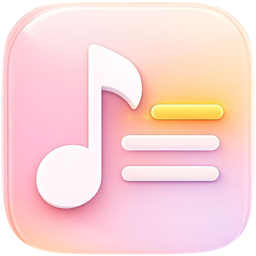
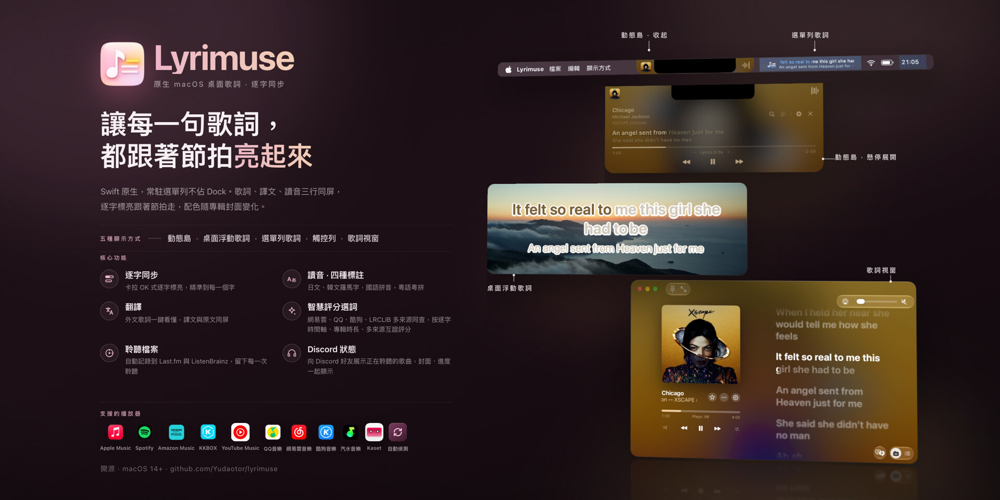
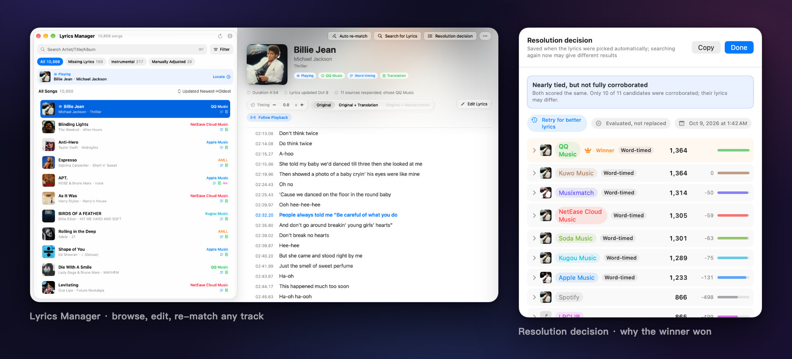
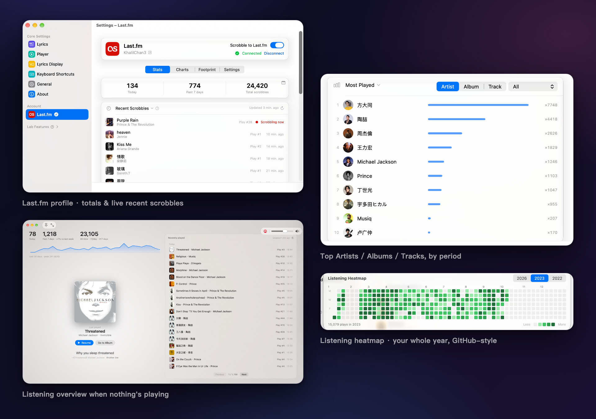
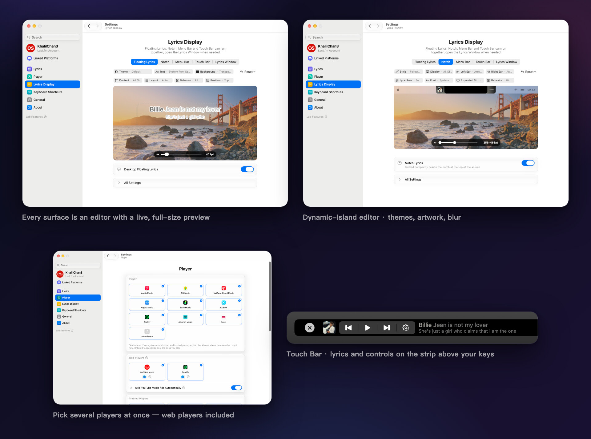

<div align="center">



# Lyrimuse

**桌面歌詞，為 Mac 全新構想。**

**語言 / Language:** [English](README.md) | [简体中文](README.zh-CN.md) | **繁體中文**


[](https://github.com/Yudaotor/lyrimuse/releases/latest)
[](https://github.com/Yudaotor/lyrimuse/commits/dev)
[](LICENSE)

</div>

https://github.com/user-attachments/assets/bf5bbc7b-39d8-43e4-af9c-a3a4cea35bc4

Lyrimuse 是一款開源的 Mac 桌面歌詞軟體。它待在選單列裡，跟著播放逐字標亮歌詞，可以常駐最上層、浮在所有視窗之上，也可以放進選單列、瀏海下的動態島膠囊或完整的歌詞視窗。支援 Apple Music、Spotify、KKBOX、Amazon Music 等八款播放器和瀏覽器裡的網頁播放器，並從十二個歌詞來源中評分挑選最合適的版本，還能顯示翻譯和讀音。另外還內建 Last.fm 聆聽檔案與播放記錄。

**從 LyricsX 過來？** LyricsX 自 2022 年 4 月後就沒有再發布新版本。Lyrimuse 涵蓋了它的核心功能並持續更新，還補上了華語播放器、KKBOX、Amazon Music 和網頁播放器的支援。詳細差異見這份逐項查證過的[與 LyricsX、Lyric Fever 的對比](docs/lyrics-apps-comparison.zh-CN.md)（簡體中文）。

**安裝：** 推薦用 Homebrew，Apple Silicon 和 Intel 通用，還會順手處理第一次打開時的 Gatekeeper 攔截。想手動安裝，可以從[最新 Release](https://github.com/Yudaotor/lyrimuse/releases/latest) 下載，步驟見[快速開始](#快速開始)。

```bash
brew tap yudaotor/lyrimuse
brew trust --cask yudaotor/lyrimuse/lyrimuse   # 只需一次：Homebrew 要求先信任非官方 tap
brew install --cask lyrimuse
```


<p align="center"><sub>四種顯示方式：歌詞視窗、動態島膠囊、逐字填色的桌面浮動歌詞、選單列歌詞</sub></p>


<p align="center"><sub>歌詞管理、每個結果都有評分的手動搜尋，還有一個面板告訴你這首歌為什麼用了這份歌詞</sub></p>


<p align="center"><sub>Last.fm 數據和排行榜、沒在播歌時的聆聽總覽，還有一張 GitHub 那樣的全年熱力圖</sub></p>


<p align="center"><sub>每一頁設定都能即時預覽，播放器可以多選（網頁播放器也行），其餘常用操作都在選單列下拉裡</sub></p>

## 功能特色

### 逐字同步歌詞，自動配對正確的版本
- **逐字填色**，跟著歌一起走。
- **十二個歌詞來源，自動幫你查**：網易雲音樂、QQ 音樂、酷狗、酷我、咪咕、Musixmatch、LRCLIB、LyricFind（經 YouTube Music）、Deezer、AMLL（人工校對的逐字歌詞庫）、汽水音樂（官方逐字）、Apple Music 自己的歌詞（在設定裡連上帳號才有）。Apple Music 是其中唯一的官方來源，很多歌還帶逐字時間軸。你不用自己去搜尋。
- **翻譯和讀音**顯示在原文下面。歌詞來源自帶社群翻譯就用它的；沒有的話，由你的 Mac 用 Apple 系統翻譯來翻，歌詞不出本機，本機翻不了再用線上翻譯備用。譯文有 17 種語言可選。讀音是一行一行判斷的：中文歌裡夾了一句日文，就只給那一句標讀音，不會給整首歌標上拼音；粵語歌會按詞標粵拼。
- **對唱按歌手分開顯示**。只要歌詞來源（或 AMLL）標了哪句是誰唱的，兩個人的詞就不會擠成一團。
- **歌詞視窗裡有 Apple Music 那些細節**：和聲單獨一行放在主句下方，對唱裡重疊的兩句一起亮到唱完，英文拖長音的字會像 Apple Music 那樣放大、發光。
- **歌詞可以單獨切換簡體或繁體**，跟 App 介面用什麼語言無關。
- **「歌詞管理」視窗**，用來整理歌詞：瀏覽、手動修改、刪除、重新搜尋任何一首，可以多選批次刪除，欄寬也能拖。某首歌時間對不上，可以單獨幫它調偏移。還沒找到歌詞的歌可以一鍵全部重試，整個曲庫也能按現在的比對規則重新挑一遍，你手動改過的不會被動到。
- **離線也能看**：快取過的歌詞不連線也能顯示。

### Last.fm 聆聽檔案與播放記錄
- **一份完整的聆聽檔案**。在設定的「帳號」裡一鍵連上 Last.fm（不用自己複製權杖），就能看到今天、近 7 天和總共聽了多少，一行即時的「正在記錄」提示，還有帶封面的最近播放，每一首都能點愛心，在 Last.fm 上標喜歡或者取消。預設按 Last.fm 曲庫裡的正式條目送出，合唱署名、簡繁寫法、「- Single」「(Remastered)」這類尾巴都會對齊到真正的歌曲頁；想完全原樣送出，可以在設定裡切到「原始」。ListenBrainz 一律原樣送出（[Scrobble 規則詳解](docs/scrobbling.zh-CN.md)）。
- **歌手、專輯、歌曲排行榜**，可以看近 7 天、近 30 天、近一年或全部，每一項都標出比上一期升了還是降了。點開一位歌手，能看到你最常聽他的哪幾首。
- **「足跡」**，單獨一個分頁。最上面是一本總帳：從第一次記錄算起的第幾天、有記錄的天數和日均、單日最多、目前和最長的連續天數、今年到現在跟往年同期比，還有離下一個整數里程碑差多少。下面依序是 GitHub 那樣的全年熱力圖、按小時和星期幾統計的聆聽時段、常聽歌手來自哪些國家和地區，最後是「那年今日」，看看往年的今天你在聽什麼。
- **每次播放都先記在本機**，還沒連 Last.fm 也照記。之後連上，中間這段會自動補傳。
- **聽到多少才算一次，你來定**：按 Last.fm 預設的 50%，或者 75%、90%，或者整首播完才算（ListenBrainz 不受影響）。也可以把某個播放器整個排除在 Last.fm 外面，它播的歌就不會進你的記錄。
- **這份記錄在歌詞視窗裡也看得到**：沒在播歌的時候，視窗會顯示聆聽總覽，而不是一片空白（後面細說）。

### 桌面浮動歌詞、選單列歌詞、動態島、完整歌詞視窗
- **播放器可以多選，也可以自動偵測**。Apple Music 和 Spotify 透過「自動化」權限讀取；QQ 音樂、網易雲音樂、酷狗音樂、汽水音樂、KKBOX、Amazon Music 走 macOS 的 MediaRemote，不需要權限。在設定裡隨意組合，或者留在自動偵測，macOS 顯示哪個在「正在播放」就跟哪個。
- **Apple Music 電台也能用**。電台裡每首歌的歌詞都跟得上；主持人說話的時候顯示電台名稱和台標，不會停在上一首。電台有自己的時間偏移，常聽的電台調一次就好。
- **瀏覽器裡的播放器也能用**。把慣用的瀏覽器配對一次，YouTube Music 或 Spotify 網頁版就跟別的播放器一樣，歌詞按網頁自己的進度列走。有個一鍵自我檢測，能先告訴你這個瀏覽器到底能不能被控制。播廣告時動態島會變黑，顯示還剩多久、這是第幾則廣告；YouTube Music 的廣告還會出現一顆跳過按鈕，也可以設成自動略過。
- **怎麼顯示，你來選**（可以同時開好幾種，也可以都不開）：
  - 桌面浮動歌詞：拖到哪裡就停在哪裡，也可以固定在螢幕頂部置中，或者 Dock 上方置中；
  - 動態島膠囊：貼在螢幕頂部，可以顯示專輯封面，還能把封面模糊後鋪在背景裡；
  - 歌詞視窗：照著 Apple Music 歌詞頁做的，大小可調，左右兩欄，模糊的封面鋪底，整首歌詞跟著捲到目前這句；Apple Music 有動態封面的專輯，封面也會動。
- **選單列歌詞（文字模式）**：目前這句直接顯示在選單列上。句子太長會捲動顯示，不會截成半句（想截斷也可以改回去）。還能多加一行，顯示下一句、譯文或讀音，動態島膠囊也可以這樣。
- **拖進度列就能跳**，歌詞視窗和動態島上都行。
- **一鍵打開這首歌的頁面**：在「⋯」選單或簡介面板裡按一下。Apple Music 直接在 App 裡打開，Spotify 跳到正在播的這首，QQ 音樂和網易雲音樂打開歌曲、專輯或歌手的網頁。連結在查歌詞的時候就找好了，不用再搜尋。
- **沒在播歌的時候**，歌詞視窗會顯示今天和本週聽了多少、「那年今日」，還有一份帶封面的最近播放，按一下就跳到 Apple Music 裡對應的專輯或歌手頁。
- **迷你歌詞視窗**：一張小卡片，只放目前這句和下一句，可以選簡潔或多行，背景、文字顏色和字體都單獨調整。
- **專輯介紹和歌手簡介**：在歌詞視窗或展開的動態島上點歌手名、專輯名就能看，內容來自 Apple Music，Apple Music 沒有時改用 Last.fm 的。
- **外觀隨你改**：字體（跟隨系統，或者匯入自己的 .ttf / .otf）、字級、文字／背景／陰影顏色（可以存成主題，也可以讓文字顏色跟著專輯封面變）、浮動視窗寬度。
- **螢幕快照、螢幕錄製、螢幕分享時自動隱藏**，你自己照樣看得見，別人看不到。
- **暫停時自動收起**，不會一直佔著桌面。

### 日常用起來的細節
- **繁體中文、簡體中文、英文介面**，切換馬上生效，不用重新啟動。
- **全域快速鍵**，每個常用動作都能綁，預設一個鍵都不佔，用哪個你自己決定。
- **設定可以搜尋**：在側欄裡打字，會直接捲到對應的那一項並反白，藏在摺疊區裡的也會自己展開。
- **自動更新**：它會自己檢查（也可以在選單列裡手動檢查），在設定的「軟體更新」頁裡安裝，更新說明和進度都在那一頁。想嘗鮮可以打開「接收測試版更新」。
- **跟播放器一起啟動**，每個播放器單獨設定，兩個方向都行：打開 Lyrimuse 時順便打開播放器，打開播放器時順便打開 Lyrimuse；還可以在它跟著的播放器都退出以後，自己也跟著退出。
- **換新 Mac**：把整套設定匯出，再到新電腦上匯入就行。出了問題還能一鍵匯出診斷資訊。

### 附加功能（可選）

<details>
<summary>ListenBrainz 同步、可分享的「正在聽什麼」網頁、日報 / 週報 / 月報 / 年度小結</summary>

下面這些預設都關著，想用哪個就在設定裡打開哪個：

- **同時同步到 [ListenBrainz](https://listenbrainz.org)**。每次播放都用同一份讀到的播放狀態，分別送給 Last.fm 和 ListenBrainz，兩邊的記錄不會對不上。iPhone 上經 Last.fm 記下的播放也會自動轉進 ListenBrainz，Mac 和 iPhone 的記錄就合成了一份。
- **一個能分享出去的「正在聽什麼」網頁**：即時播放、歷史記錄、留言牆、表情回應、訪客計數、Top10 歌手排行榜、黑膠唱片效果、深淺色主題，傳到聊天軟體裡還會展開成預覽卡片。效果展示和從零搭建的步驟見 **[網頁玩法教學](https://github.com/Yudaotor/nowplaying-workers#readme)**。
- **日報、週報、月報和年度聆聽小結**，透過推播通知發給你（Bark、釘釘、企業微信、Discord、飛書、Server酱、Telegram 都支援）。

這些都在設定的「附加功能」裡，每張卡片都附有分步說明：去哪申請 API Key 或權杖、怎麼連線帳號、怎麼拿到推播平台的 Webhook 位址。只有網頁那項單獨寫了一份教學，而且也不是非架不可：只設定好 ListenBrainz，網頁就已經能顯示即時播放和歷史記錄，不用部署 Cloudflare Worker。想要留言牆、表情回應、訪客計數、Top10 歌手排行榜和更快的更新，再照著教學部署一個。

</details>

## 快速開始

Lyrimuse 的發布包用的是專案自己的簽章憑證，不是 Apple 開發者 ID，所以下面哪種裝法都用不到 Apple 開發者帳號。代價是第一次打開時，Gatekeeper 會提示「來自身分不明的開發者」。用 Homebrew 裝（方案 A）會自動處理掉；用其他方式裝的話，看到這個提示是正常的，不是 bug，方案 B 裡寫了怎麼一次解決。
### 方案 0：把安裝交給 AI

如果你的 Mac 上跑著能執行終端機指令的 AI 助理（Claude Code、Codex CLI、Gemini CLI 等），把下面這段話**原樣**貼給它，方案 A／B 的所有步驟它都會替你做完。這段話只允許它安裝這一個 App，全程不用 `sudo`，也不碰系統級安全設定：

```text
請在這台 Mac 上安裝 Lyrimuse——一個開源的 macOS 選單列歌詞 App
（https://github.com/Yudaotor/lyrimuse），嚴格按以下規則執行：

1. 首選路徑（如果有 `brew`）：
     brew tap yudaotor/lyrimuse
     brew trust --cask yudaotor/lyrimuse/lyrimuse
     brew install --cask lyrimuse
   如果這台機器的 Homebrew 沒有 trust 子指令，跳過那一行——舊版本不需要。
2. 沒裝 Homebrew 的話，不要替我安裝 Homebrew。改走手動路徑：先用 `uname -m`
   確認晶片架構，去 https://github.com/Yudaotor/lyrimuse/releases 下載最新版本
   對應的檔案——arm64 下載 `Lyrimuse-v<版本>-macos.zip`，x86_64 下載
   `Lyrimuse-v<版本>-macos-intel.zip`——用同處提供的 `.sha256` 檔案驗證
   （`shasum -c`），解壓後把 `Lyrimuse.app` 移進 /Applications，然後只對這
   一個 App 清除 Gatekeeper 隔離標記：
     xattr -dr com.apple.quarantine /Applications/Lyrimuse.app
3. 安全紅線：全程不用 `sudo`（這裡沒有任何一步需要它）；絕不執行
   `spctl --master-disable` 或任何全域關閉 Gatekeeper 的操作；除
   /Applications/Lyrimuse.app 外不得對任何東西清除隔離標記。
4. 除非我明確要求，不要從原始碼建置。
5. 啟動它（`open -a Lyrimuse`），並確認在執行（`pgrep -x Lyrimuse` 能印出 PID）。
6. 首次啟動會彈出設定引導——那部分由我自己按：告訴我它會讓我選播放器、
   （只在選了 Apple Music 或 Spotify 時）授權對它們的「自動化」取用、以及啟用背景
   擷取服務，然後把控制權交還給我。
最後用中文回報你做了什麼、有沒有失敗的步驟。
```

### 方案 A：用 Homebrew 安裝（推薦）

```bash
brew tap yudaotor/lyrimuse
brew trust --cask yudaotor/lyrimuse/lyrimuse   # 只需一次：Homebrew 要求先信任非官方 tap
brew install --cask lyrimuse
```

安裝過程中會自動清掉這次的 Gatekeeper 隔離標記，不需要額外操作。`brew install` 跑完，直接從 `/Applications`（或者 Spotlight）打開 Lyrimuse 就行。以後有新版本，`brew upgrade --cask lyrimuse` 同樣能自動處理。

### 方案 B：手動下載預先建置的版本

1. 去 [Releases 頁面](https://github.com/Yudaotor/lyrimuse/releases) 下載。**先看清自己是哪種 Mac**（左上角  → 關於這台 Mac →「晶片」：`Apple M…` 是 Apple Silicon，`Intel Core…` 是 Intel）：

   | 你的 Mac | 下載這份 |
   | --- | --- |
   | Apple Silicon（M1 及以後） | `Lyrimuse-*-macos.dmg` 或 `.zip` |
   | Intel | `Lyrimuse-*-macos-intel.dmg` 或 `.zip` |

   dmg 按兩下掛載後把 `Lyrimuse.app` 拖移到旁邊的 `Applications` 上；zip 解壓後把 `Lyrimuse.app` 拖移進 `/Applications`。兩種格式裝出來完全是同一個 App，zip 還附帶一份 `.sha256`，想核對下載完整性就在同一目錄裡跑 `shasum -c Lyrimuse-*.zip.sha256`。

   兩份的區別只在架構：不帶字尾的那份是純 Apple Silicon，`-intel` 那份同時含 Intel 和 Apple Silicon 兩套程式碼。`-intel` 也能在 Apple Silicon 上跑，但沒必要：體積大一倍，而且 macOS 27 及以後會因為它含 Intel 程式碼而提示「需要更新 App」（Apple 要在 macOS 28 移除 Rosetta；App 本身沒問題）。

   **兩種架構都有 App 內自動更新。** 更新來源裡為同一個版本登記了兩條，各自對應一種架構：Apple Silicon 收到不帶字尾的那份，Intel 收到 `-intel` 那份，Sparkle 按機器自己挑，你不用管。（v1.4.0 及更早只服務 Apple Silicon，Intel 使用者當時得回這個頁面手動下載。）
2. 第一次打開時 macOS 會拒絕執行，提示「Lyrimuse 已損毀，無法打開」或「來自身分不明的開發者」。用下面任何一種方式解鎖一次即可：

   - **終端機指令（推薦，永遠有效）：**
     ```bash
     xattr -dr com.apple.quarantine /Applications/Lyrimuse.app
     ```
     然後正常打開即可，每份下載只需要做一次。
   - **按右鍵 → 打開：** 在 Finder 裡按右鍵（或 Control-按一下）`Lyrimuse.app`，選擇「打開」，對話框裡再確認一次「打開」。不是每個 macOS 版本、每種提示都能用這招，不行的話回頭用上面的終端機指令。
   - **系統設定 → 隱私權與安全性：** 先試著打開一次（會被攔下），再打開**系統設定 → 隱私權與安全性**，捲到最底部，按 Lyrimuse 警告旁邊的「強制打開」，對話框裡再確認一次。

   只對你真正信任的建置版本執行這幾條指令，比如這個儲存庫自己 Releases 頁面下載的，或者你自己建置的那份。

### 方案 C：自己建置

**一次性前置依賴**（已經裝過的可以跳過）：

```bash
xcode-select --install   # Xcode 的 Command Line Tools，跑 Swift 用——`swift --version` 能跑就說明已經裝過
brew install go          # 任何 ≥1.21 的 Go 都行——build.sh 會透過 GOTOOLCHAIN 自動切到 1.24.4
```

裝好之後，`build.sh` 會一次性把 App 和它的背景擷取器都建置好：

```bash
git clone https://github.com/Yudaotor/lyrimuse.git
cd lyrimuse/lyrimuse
./build.sh               # 建置目前這台機器的架構
./build.sh --universal   # 建置 arm64 + x86_64 的 universal 包（給 Intel 用的那份相容包）
```

`build.sh` 最後會把包裡每個二進位檔的架構列出來，跟目標不符（缺一半、或多帶了一份）都會回報。發佈資產不要手工打，用 `./package.sh`，它自己會把兩種架構各建置一次、各出一套 zip + sha256 + dmg，架構不符直接拒絕打包。

QQ 音樂／網易雲音樂／酷狗音樂／汽水音樂／KKBOX／Amazon Music／Spotify／自動偵測這幾個播放來源支援額外需要 [ungive/media-control](https://github.com/ungive/media-control)。本機沒裝的話 `build.sh` 會自動用 Homebrew 裝一次，這一步也不需要你自己動手。

### 不管選哪種方案

從 `/Applications` 打開 Lyrimuse，首次啟動的設定引導會帶你完成：選播放器（Apple Music、QQ 音樂、網易雲音樂、酷狗音樂、汽水音樂、KKBOX、Amazon Music、Spotify，或者自動偵測），選了 Apple Music 或 Spotify 的話再授予對它的「自動化」權限（其它幾個都不需要額外權限），以及啟用它的背景常駐擷取服務（這樣就算把視窗關掉，歌詞／封面也會持續解析）。走完引導歌詞馬上就會顯示出來（更多建置選項見 [lyrimuse/README.md](lyrimuse/README.md)）。

看歌詞只需要這些。上面那些附加功能，之後想用了再到設定裡打開就行。

## 常見問題

### Mac 上怎麼讓 Apple Music 的歌詞浮動在桌面、一直置頂？
在設定裡打開桌面浮動歌詞就行。它浮在所有視窗上面，切換桌面也會跟著。可以拖到任何位置，也可以固定在螢幕頂部置中，或者 Dock 上方置中。歌詞帶逐字時間軸的話，唱到哪個字就亮到哪個字。螢幕快照、螢幕錄製和螢幕分享時可以讓它只有你自己看得見，暫停時也能自動收起。QQ 音樂、網易雲音樂、酷狗音樂、汽水音樂、KKBOX、Amazon Music、Spotify 和網頁播放器也都一樣。

### Spotify 的歌詞能顯示在 Mac 選單列上嗎？
可以。打開選單列文字模式，目前這句歌詞就顯示在選單列上，Spotify 和其他支援的播放器都可以。句子太長會捲動，不會被截斷；還能多加一行，顯示下一句、譯文或讀音。不用登入 Spotify 帳號。Lyrimuse 會請求一次控制 Spotify 的「自動化」權限，有了它進度才精確，播放按鈕也才能用；不給的話歌詞照樣顯示，只是進度改從 macOS 的 MediaRemote 讀，可能差一秒左右。

### QQ 音樂、網易雲、酷狗、汽水音樂能顯示逐字歌詞嗎？
可以，只要歌詞本身帶逐字時間軸。網易雲、QQ 音樂、酷狗、汽水音樂、Musixmatch、AMLL 和 Apple Music 的歌詞大多有，這些會一個字一個字地亮；只有逐行時間的就整行亮。用哪個播放器聽，也不影響去哪裡找歌詞：在汽水音樂裡播放的歌，如果 QQ 音樂那份逐字歌詞分數最高，最後用的就是它。

### 裝這個需要 Apple 開發者帳號嗎？
不需要。發布包用的是專案自己的簽章憑證，不是 Apple 開發者 ID，你不需要開發者帳號，這個專案也沒有。第一次打開要過一下 Gatekeeper 也是這個原因，見上面的「快速開始」。

### Mac App Store 上有嗎？
沒有。用 Homebrew 裝（上面的方案 A），或者到 [Releases 頁面](https://github.com/Yudaotor/lyrimuse/releases) 下載（方案 B）。不管哪種，之後的更新都在 App 裡完成。

### Lyrimuse 免費嗎？
免費。它是 GPL-3.0 開源的，沒有付費版，沒有 App 內購買，也不用註冊帳號。Last.fm 這些帳號連不連都隨你。

### 只支援 Apple Music 嗎，Spotify、QQ 音樂、網易雲音樂能用嗎？
都能用，另外還有酷狗音樂、汽水音樂、KKBOX 和 Amazon Music，一共八個播放器，還有瀏覽器裡的網頁版 YouTube Music / Spotify；也可以交給自動偵測，macOS 顯示哪個在「正在播放」就跟哪個。Apple Music 和 Spotify 需要「自動化」權限（Spotify 用它取得精確進度、控制播放），其他六個走 macOS 的 MediaRemote，不需要任何權限。用 KKBOX 或 Amazon Music 播放時，它們自己存下的這首歌詞也會拿來比較，Lyrimuse 不會向這兩家發出任何請求。

### KKBOX、Amazon Music 在 Mac 上能顯示桌面歌詞嗎？
可以。這兩家都透過 macOS 的 MediaRemote 讀取，不用給權限，歌詞和其他播放器一樣能顯示在桌面浮動視窗、選單列、動態島膠囊和歌詞視窗裡。如果 KKBOX 或 Amazon Music 自己已經存了這首歌的歌詞，也會拿來一起比較，並且額外加分。Lyrimuse 不登入這兩家的帳號，也不向它們發出請求。其他歌詞來源照樣會查，哪家的版本更好（例如帶逐字時間軸），就用哪家的。

### Mac 桌面歌詞是什麼效果？
就像桌面上的卡拉 OK。目前這句浮在所有視窗上面，歌詞帶逐字時間軸的話，唱到哪個字就亮到哪個字，需要的話譯文或讀音跟在原文旁邊。字體、字級、文字／背景／陰影顏色和寬度都能調，文字顏色還可以跟著專輯封面變。同樣的歌詞也能放進選單列、瀏海下的動態島膠囊，或者一個仿 Apple Music 的完整歌詞視窗，幾種可以同時開。

### 沒有瀏海的 Mac 也能用動態島膠囊嗎？
可以。在沒有瀏海的螢幕上（例如舊款 MacBook 或外接顯示器），膠囊會貼在螢幕頂部置中，跟選單列一樣高。放在哪個螢幕上，可以在設定裡選。

### 沒有網路能看歌詞嗎？
找過一次歌詞的歌就能看，歌詞已經快取在你的 Mac 上了。第一次幫一首歌找歌詞，還有線上翻譯，都需要網路。

### 我的資料會傳到外面嗎？
找歌詞時，得把正在播的這首歌拿去問各個歌詞來源：網易雲、QQ、酷狗、酷我、咪咕、Musixmatch、LRCLIB、LyricFind、Deezer、AMLL、汽水音樂，連了帳號的話還有 Apple Music。封面從 iTunes Search 查。翻譯預設在本機完成，只有本機翻不了時，才會把歌詞文字送給線上翻譯（先 Google 網頁翻譯，再 MyMemory）。你的聆聽記錄、快取的歌詞和設定都存在你 Mac 上的檔案裡，除非你自己連上 Last.fm、ListenBrainz 或那個可選的網頁中繼。完整清單見下面的「[授權與版權說明](#授權與版權說明)」。

### 能標日文／韓文讀音，或者翻中文嗎？
可以。讀音是一行一行判斷的，幾種語言混著唱的歌，只會在該標的行上標，粵語歌還會標粵拼。翻譯優先用歌詞來源自帶的社群翻譯，沒有就用本機或線上的機器翻譯，可以翻成 17 種語言。

### 支援哪些 macOS 版本？
macOS 14 Sonoma 以上（Sequoia、Tahoe 以及更新的版本都可以），Apple Silicon 和 Intel 都支援。要在本機翻譯，需要 macOS 15 Sequoia 以上，更早的系統只能用線上翻譯。

### 支援 Intel Mac 嗎？
支援，用單獨的 universal 包（見上面方案 B）。從 v1.5.0 起，Intel 版也能在 App 裡自動更新，有新版本時跟 Apple Silicon 一樣會提示你。

### 瀏覽器裡播放的 YouTube Music / Spotify 網頁版能顯示歌詞嗎？
可以。在設定裡把慣用的瀏覽器配對一次，YouTube Music 或 Spotify 網頁版就能像別的播放器一樣用。歌詞跟著網頁自己的進度列走，不是估出來的；配對之前還能一鍵自我檢測，先看看這個瀏覽器能不能被控制。

### Mac 上能把 Apple Music 的播放記錄同步到 Last.fm 嗎？
可以，這是它除了歌詞之外的另一半。在設定裡一鍵連上 Last.fm，Apple Music（以及其他支援的播放器）的每次播放都會記錄上去，還會即時顯示「正在播放」。每次播放都先記在本機，所以連上之前聽的歌也不會遺漏，連上以後會補傳。聽到多少算一次可以選 50%、75%、90% 或者整首播完，某些播放器可以排除在外，也可以同時送到 ListenBrainz。

### 怎麼確保配對到的歌詞是對的？
它不會哪個來源先回傳就用哪個。所有來源回傳的結果放在一起，按同一套標準評分：歌名、歌手、專輯、時長對不對得上，再加上有沒有逐字時間軸這類品質因素，分數最高的勝出。每首歌都能看到這個過程：有個面板列出每份候選的分數，以及最後那份為什麼勝出。之後要是某個來源出了更乾淨、更完整的版本，Lyrimuse 可以自動換過去；你親手選的歌詞會被鎖定，不會被自動替換。手動搜尋裡也顯示同樣的分數和標註，選錯版本一眼就能看出來。

### 歌詞不同步或者找錯了怎麼辦？
時間對不上，就幫這首歌調個偏移，以後再播這首都會記住。歌詞不對或者版本不對，就打開手動搜尋，所有歌詞來源的結果連同分數都列在那裡；你選中的那份會被鎖定，自動配對不會再換掉它。任何一首歌的歌詞也都能在「歌詞管理」裡自己修改。

### 能把歌詞存成 .lrc 檔案嗎？
本來就存著。每首找到歌詞的歌都有一份逐行時間的 `.lrc`；有譯文、讀音的，另外還有 `.tr.lrc` 和 `.roma.lrc`。逐字時間軸單獨存成 `.yrc`，用的是網易雲的 YRC 格式，大多數其他播放器讀不了。檔案放在 `~/.config/lyrimuse/lyrics/`，位置可以在設定裡改。

### LyricsX 還在維護嗎？Lyrimuse 和 LyricsX、Lyric Fever 有什麼差別？
LyricsX 最後一個版本是 2022 年 4 月的 v1.6.3，支援 macOS 10.11 以上，能搭配 Apple Music、Spotify 和幾個老牌播放器使用。Lyric Fever 主要做 Spotify 和 Apple Music，需要 macOS 15 以上。Lyrimuse 需要 macOS 14 以上，另外支援 QQ 音樂、網易雲音樂、酷狗、汽水音樂、KKBOX、Amazon Music 和瀏覽器裡的播放器，能逐行標拼音、粵拼和日文假名，還能把播放記錄（scrobble）送到 Last.fm / ListenBrainz，並在本機統計你的聆聽數據。逐項查證過的對照表見[對比頁](docs/lyrics-apps-comparison.zh-CN.md)（簡體中文）。
## 授權與版權說明

- **Lyrimuse 本身以 [GPL-3.0](LICENSE) 授權。** 隨 App 一起發佈的開源元件與詞典資料（media-control、Sparkle、KeyboardShortcuts、OpenCC 與 rime-cantonese 詞典）各自保留原授權條款，全文見 [THIRD_PARTY_LICENSES](THIRD_PARTY_LICENSES)；這個檔案也打進了 App 包裡，**設定 → 關於 → 第三方授權**能直接打開。
- **歌詞、封面與曲目資訊的版權歸各自的權利人所有。** Lyrimuse 只做檢索、快取與顯示：公開歌詞介面回傳什麼，就存在你自己 Mac 上的 `~/.config/lyrimuse/` 裡給你自己看，不代管、不轉發、不再散佈任何歌詞或封面；快取隨時可以在「歌詞管理」裡刪，或者直接刪掉那個檔案夾。
- **Lyrimuse 是獨立的開源專案**，與 Apple、騰訊（QQ 音樂）、網易（網易雲音樂）、酷狗、酷我、抖音（汽水音樂）、KKBOX、Amazon（Amazon Music）、中國移動（咪咕音樂）、Spotify、Google（YouTube Music、Google 翻譯）、Last.fm、ListenBrainz、MusicBrainz、Musixmatch、LRCLIB、LyricFind、Deezer、AMLL、SponsorBlock 均無隸屬、合作或背書關係。這些名稱和商標歸各自所有者，這裡提到它們只是為了說明支援哪些播放器、歌詞來源和用到的服務。
- **會離開你 Mac 的只有這些。** 解析歌詞時把歌手、歌名、專輯（部分來源還帶時長）發給上面十二個歌詞來源；全部落空時還會把歌手名發給 MusicBrainz 查別名（Last.fm 智慧比對遇到沒見過的歌手時也會這樣查）；排行榜裡的歌手也會按 MusicBrainz ID 去那裡查國家／地區和相關連結。封面與閒置頁把歌手加歌名發給 iTunes Search。專輯介紹和歌手簡介按 Apple Music 的專輯 ID、歌手 ID 請求它們的公開頁面，不需要登入 Apple 帳號。機器翻譯備用（預設關，且只在裝置端 Apple 翻譯不可用時）會把**歌詞內文**分塊先送給 Google 網頁翻譯，還沒翻出來的再送給 MyMemory；送給 MyMemory 的請求附一個隨機產生的電子郵件參數，不是你的。YouTube Music 播放 MV 時，會把影片 ID 的 SHA-256 雜湊前 4 碼送給 SponsorBlock，查出 MV 裡不是音樂的片段、讓歌詞對上畫面——SponsorBlock 憑這幾碼分辨不出是哪支影片。Musixmatch 的網域走 DNS over HTTPS，解析請求發給 Cloudflare（1.1.1.1）和 Google（8.8.8.8）。「關於」頁最多每 6 小時向 GitHub API 查一次 Star 數，開啟「接收測試版更新」後最多每小時查一次 Release 列表；檢查更新只拉 GitHub Releases 上的 appcast，不上報系統資訊。除此之外只有你主動連線的 Last.fm、ListenBrainz、推播平台和網頁中繼（中繼的 Top10 歌手頁會向 Deezer 查歌手頭像）。每一筆對外請求都記進本機稽核記錄檔（只記網域和操作名，不記參數和憑證），「匯出診斷資訊」裡能看到。

## 疑難排解

歌詞出不來時，先在設定的「歌詞來源」裡按「測試」，看看是哪個來源連不上。還解決不了的話，用「匯出診斷」匯出一份診斷資訊，附在 [issue](https://github.com/Yudaotor/lyrimuse/issues) 裡。診斷裡已經附上了背景服務的完整自我檢查結果。

<details>
<summary>命令列自我檢查</summary>

同樣的檢查，也可以在終端機裡跑：

```sh
/Applications/Lyrimuse.app/Contents/Resources/lyrimuse-engine healthcheck
/Applications/Lyrimuse.app/Contents/Resources/lyrimuse-engine healthcheck -local-only  # 不連線
/Applications/Lyrimuse.app/Contents/Resources/lyrimuse-engine healthcheck -json
```

</details>

## 解除安裝

把 `Lyrimuse.app` 拖移進垃圾桶**是不夠的**。歌詞引擎（行程名稱 `lyrimuse-engine`）在 launchd 裡註冊的是 `KeepAlive`
類型的 job，它的 LaunchAgent 會留下來，於是 launchd 會一直去啟動一個已經不存在的二進位檔。

```sh
lyrimuse/scripts/uninstall.sh              # 只看：回報目前裝了什麼
lyrimuse/scripts/uninstall.sh --services   # 註銷兩個 launchd job，資料一律保留
lyrimuse/scripts/uninstall.sh --purge      # 連設定、快取、記錄檔、偏好設定一起刪
```

不帶參數執行不會改動任何東西，只是告訴你系統裡現在有什麼。`--purge` 會先把要刪的東西
逐一列出來、提醒你其中有多少個已匯出的歌詞檔案，並且要求手動輸入 `yes` 才繼續。

`--services` 不碰偏好設定；`--purge` 會連偏好設定一起刪（`defaults delete
me.yudaotor.lyrimuse`）。留著它會把重裝引向一條死路：LaunchAgent 已經刪了、歌詞引擎
沒裝，而 App 仍然認為引導走完過——於是那扇能把服務裝回去的引導頁永遠不出現，桌面就
一直停在「搜尋歌詞中…」。

## 專案結構

本儲存庫就是 App 本身：

- [`lyrimuse/`](lyrimuse) —— App 本體（Swift，SwiftUI + AppKit）
- [`lyrimuse-collector/`](lyrimuse-collector) —— 背景引擎，負責解析歌詞／封面並餵給 App（Go）；建置時自動打包進 App

<details>
<summary>可選的網頁體驗：兩個兄弟儲存庫</summary>

可選的網頁體驗拆在兩個獨立的兄弟儲存庫裡，想 fork 哪個都不用碰 App：

| 儲存庫 | 角色 |
|---|---|
| [`Yudaotor/nowplaying`](https://github.com/Yudaotor/nowplaying) | 可分享的「正在聽什麼」網頁本體，外帶一份可直接 fork 的模板 |
| [`Yudaotor/nowplaying-workers`](https://github.com/Yudaotor/nowplaying-workers) | 網頁背後的 Cloudflare Worker 中繼 + 即時 README 徽章，配完整的從零搭建教學 |

```
本儲存庫 (App + 擷取器)  ──推送──▶  nowplaying-workers (中繼)  ◀──讀取──  nowplaying (網頁)
```

</details>

## 致謝

感謝 [LyricsX](https://github.com/ddddxxx/LyricsX)，它讓人看到了 Mac 上的桌面歌詞可以做成什麼樣子。

<details>
<summary>Lyrimuse 用到的開源專案和社群資料</summary>

- [media-control](https://github.com/ungive/media-control) 與 [mediaremote-adapter](https://github.com/ungive/mediaremote-adapter)：讀取 macOS 的「正在播放」
- [Sparkle](https://github.com/sparkle-project/Sparkle)：App 內更新
- [KeyboardShortcuts](https://github.com/sindresorhus/KeyboardShortcuts)：全域快速鍵
- [OpenCC](https://github.com/BYVoid/OpenCC)：簡繁轉換
- [rime-cantonese](https://github.com/rime/rime-cantonese)：粵拼
- [AMLL TTML DB](https://github.com/amll-dev/amll-ttml-db)：社群校對的逐字歌詞
- [LRCLIB](https://lrclib.net)：開放的同步歌詞庫
- [SponsorBlock](https://sponsor.ajay.app)：MV 裡非音樂片段的標註

</details>

各自的授權條款全文見 [THIRD_PARTY_LICENSES](THIRD_PARTY_LICENSES)。
