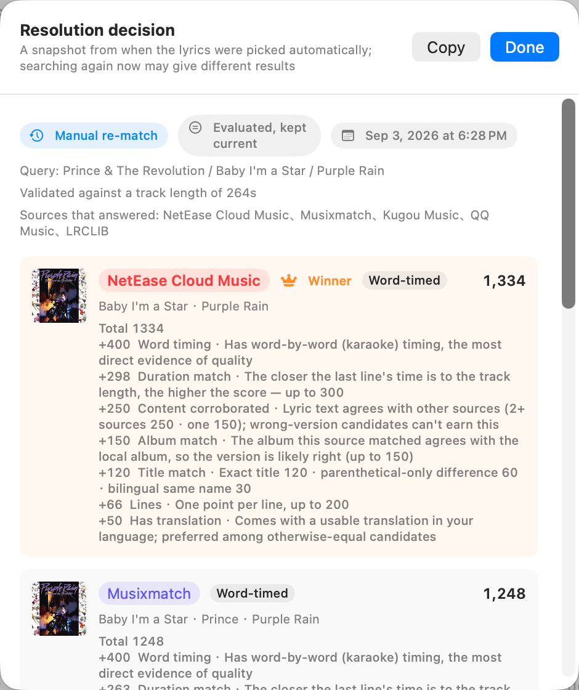

# Desktop lyrics apps for macOS in 2026: Lyrimuse vs LyricsX vs Lyric Fever

**Language:** **English** | [简体中文](lyrics-apps-comparison.zh-CN.md)

> **Disclosure:** this page is maintained by the author of Lyrimuse, so read it with that in mind.
> Every factual claim below was checked against each project's own public repository and README on
> **2026-09-05**; "—" means a feature is *not advertised* in that project's own materials as of that
> date, not necessarily that it's absent. Corrections are welcome —
> [open an issue](https://github.com/Yudaotor/lyrimuse/issues).

**Is LyricsX still maintained?** Not actively: [LyricsX](https://github.com/ddddxxx/LyricsX)'s last
release was **v1.6.3 in April 2022**, though the repository still receives an occasional commit.
That's the question that brings most people to this page, so here is a factual, current comparison
of the actively maintained open-source options:

- **[Lyric Fever](https://github.com/aviwad/LyricFever)** (MIT) — Spotify + Apple Music lyrics,
  macOS 15+. Describes itself as a "spiritual successor to LyricsX".
- **[Lyrimuse](https://github.com/Yudaotor/lyrimuse)** (GPL-3.0, this project) — word-synced lyrics
  for Apple Music, Spotify **and the Chinese players (QQ Music, NetEase Cloud Music, Kugou)**, plus
  YouTube Music / Spotify Web playing in any browser; 8 lyric sources checked automatically, with
  **every candidate scored on one scale so the best match wins** (and the decision shown per
  track); translation, pinyin / Cantonese Jyutping / furigana; Last.fm & ListenBrainz scrobbling
  with local listening stats. macOS 14+, Apple Silicon and Intel.

**What about OSD Lyrics?** It's a Linux desktop-lyrics app, not a macOS one — it shows up in
"LyricsX alternative" lists but won't run on a Mac.

## Side-by-side (facts checked 2026-09-05)

| | **Lyrimuse** | **LyricsX** | **Lyric Fever** |
|---|---|---|---|
| License · price | GPL-3.0 · free | MPL-2.0 · free | MIT · free |
| Latest release | v1.5.0 (Sep 2026) | v1.6.3 (Apr 2022) | v3.3 (Nov 2025) |
| Minimum macOS | 14 (Sonoma) | 10.11 | 15 (Sequoia) |
| Players | Apple Music, Spotify, QQ Music, NetEase Cloud Music, Kugou — any combination | Apple Music, Spotify, Vox, Audirvana, Swinsian (via its MusicPlayer library) | Spotify, Apple Music |
| Web players in a browser | YouTube Music & Spotify Web, synced to the page's own progress | — | — |
| Lyric sources checked automatically | 8: NetEase, QQ Music, Kugou, Kuwo, Musixmatch, LRCLIB, LyricFind, AMLL | multiple, via its LyricsKit library | 3: Spotify, LRCLIB, NetEase |
| Match selection | every candidate from every source scored on one scale (title / artist / album / reported-duration fit + quality signals like word-level timing); a per-track decision panel shows each candidate's score and why the winner won; manual picks are locked and never overridden | — | — |
| Word-by-word sync | yes, across sources (incl. the hand-curated AMLL database) | via LRCX word time tags, when the source provides them | — |
| Translation | source community translation when available, else on-device Apple translation (18 target languages) with online fallback | displays source-provided translations | Apple on-device translation |
| Romanization | per-line pinyin, **Cantonese Jyutping**, Japanese furigana | — | — |
| Simplified ⇄ Traditional Chinese | yes, independent of UI language | yes | — |
| Duet / multi-singer line splitting | yes, when the source marks parts | — | — |
| Scrobbling & listening stats | Last.fm + ListenBrainz scrobbling, backfill, local history, charts, listening heatmap | — | — |
| Display surfaces | floating overlay, Dynamic-Island-style capsule, menu bar lyrics, full lyrics window | desktop + menu bar | menu bar, fullscreen view, karaoke popup |
| UI languages | English, Simplified Chinese, Traditional Chinese | multiple (Crowdin) | English, Simplified Chinese |

## Where Lyrimuse fits

Lyrimuse is built for listeners the other two don't fully cover: you play music through
**QQ Music, NetEase Cloud Music or Kugou** (not just Apple Music / Spotify); you play
**YouTube Music or Spotify in a browser** and still want desktop lyrics synced to the page's own
progress; you want **Cantonese Jyutping or Japanese furigana** readings alongside the original
lines; or you want **Last.fm / ListenBrainz scrobbling and listening stats** in the same app that
shows your lyrics — all of it free, open source, and actively maintained.

Matching is also **score-driven rather than first-hit**: anyone who has used multi-source lyrics
apps knows the pain of a wrong version getting picked. Lyrimuse ranks every candidate from every
source on title / artist / album / reported-duration fit plus quality signals such as word-level
timing, shows you each track's decision with per-candidate scores, can upgrade automatically when
a source later offers a cleaner match — and locks any lyric you picked by hand so it's never
overridden.

 The per-track resolution panel: every candidate's score, and why the winner won.

**Install:** `brew tap yudaotor/lyrimuse && brew install --cask lyrimuse` (Apple Silicon and
Intel), or download from the
[Releases page](https://github.com/Yudaotor/lyrimuse/releases/latest) — full options in
[Getting Started](https://github.com/Yudaotor/lyrimuse/blob/main/README.md#getting-started).
