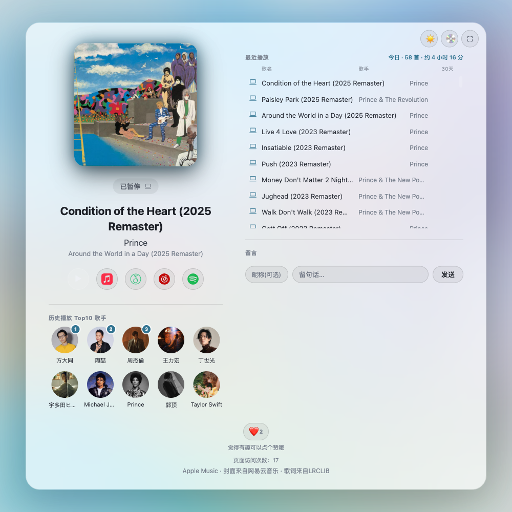
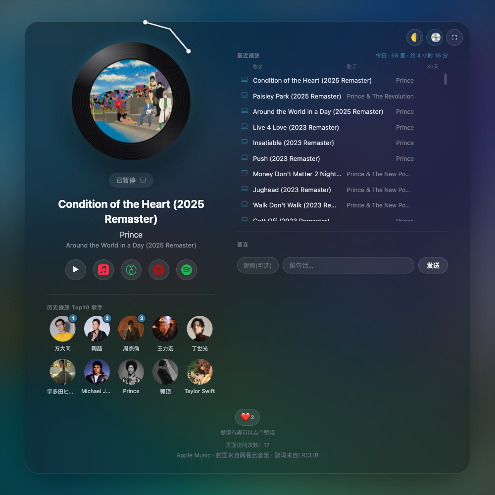
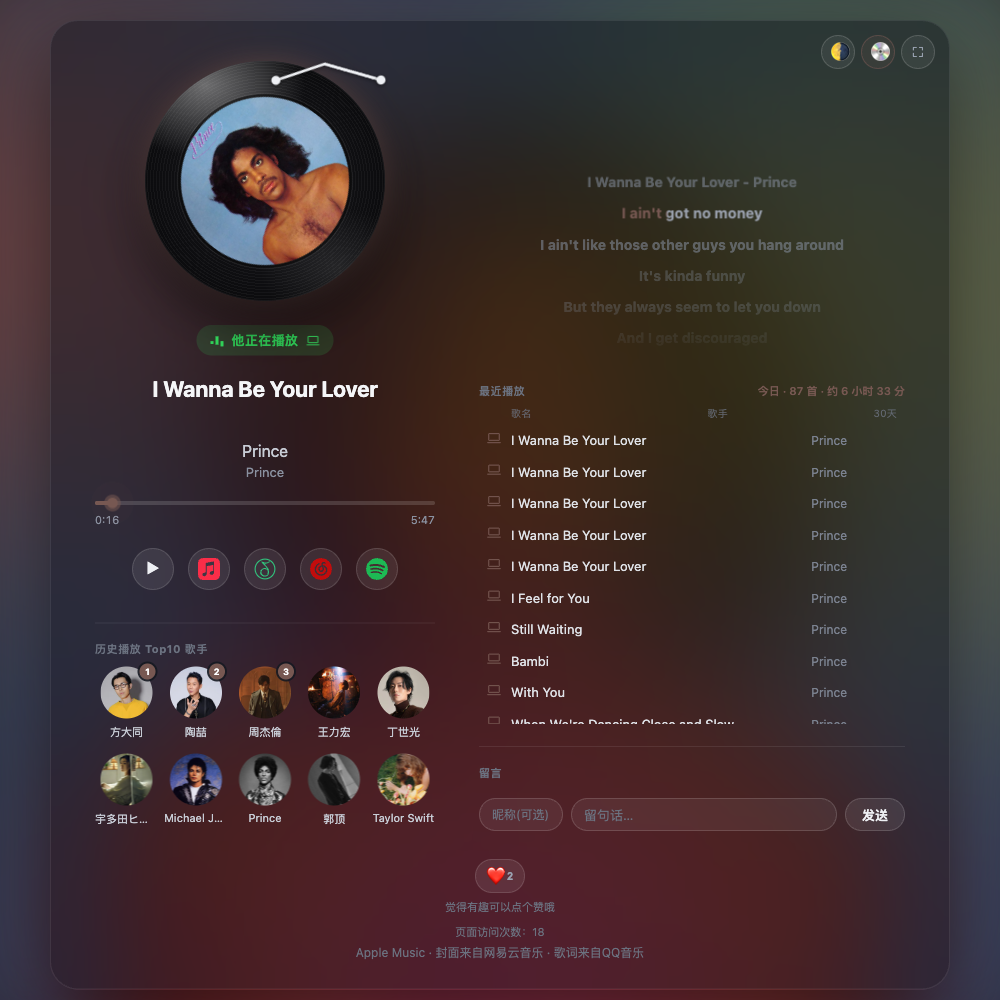

# 网页玩法：把"正在听什么"做成一个能分享的网页

**语言 / Language：** [English](web-features.md) | **简体中文**

这篇文档只讲一件事：**collector 顺带解锁的网页展示页**——效果长什么样、数据怎么流动、怎么从零搭一套自己的。

跟 Lyrimuse 悬浮歌词本体完全独立、完全可选：不搭这一套，悬浮歌词照常显示逐字歌词，不受任何影响。这套东西的意义是——你已经在跑 collector 采集"正在播放"状态了，顺手就能把它做成一个可以到处分享的固定链接，比如放进飞书个性签名、Twitter/X 简介，或者干脆自己留着当一个"我的音乐主页"。

## 效果展示

### 桌面端（≥820px 宽屏铺两栏）

浅色氛围主题，暂停态：



深色氛围主题 + 黑胶模式（暂停态时唱臂会抬起，播放中会匀速旋转，这张截图拍到的正是暂停这一刻）：



播放中——进度条走动、歌词逐字高亮，背景色也会跟着当前封面走：



这三张都是这个项目作者自己在跑的真实页面（<https://yudaotor.github.io/nowplaying/?user=yudaotor>），不是摆拍的示例数据。

### 每个模块具体是什么

- **正在播放卡片**：封面（带呼吸缩放动效）、歌名/歌手/专辑、进度条（外推实时位置，不用每秒轮询）、播放状态胶囊（"他正在播放" / "已暂停" / "上次播放 · N 分钟前"）、设备图标（Mac / iPhone 线描图标）。封面取不到时客户端会用 iTunes 搜索兜底占位，服务端解析出真封面后再无缝替换。
- **黑胶模式**（右上角 💿）：封面缩成黑胶唱片中心的"标签"，播放时匀速旋转、暂停时唱臂抬起——纯 CSS + Web Animations API，不额外耗电。跟"方形封面"模式二选一，记在浏览器本地，不影响其他访客看到的样式。
- **同步歌词**：只在"当前正在播放、有精确进度"时显示（iPhone 经 Last.fm 桥接来的播放没有进度数据，这时不显示歌词，只显示歌名）。支持逐字高亮（网易云 yrc 格式）、整行高亮两种，罗马音/翻译各自一行。手动滑动歌词面板会暂停自动跟随，停手几秒后自动滚回当前行。
- **最近播放历史**：今天/更早分割线，每行标注 Mac/iPhone 设备图标 + 近 30 天播放次数（≥2 次才显示，避免满屏都是"×1"没有信息量）。今日统计单独一行"今日 · N 首 · 约 X 小时 Y 分"。
- **留言墙**：匿名（或填昵称）留一句话，全站共享，最多保留最新 50 条。纯 `textContent` 渲染，天然防 XSS。
- **表情反应**：一个 ❤️ 按钮，全站累计点赞数（不跟哪首歌绑定）。
- **访客计数**：同一浏览器只计一次（`localStorage` 去重），清缓存/换浏览器/无痕模式会被重新计入一次。
- **历史播放 Top10 歌手**：按全时段总播放次数排的常驻榜单，一天更新一次（不用实时）。前三名有名次角标，头像取自 Deezer，取不到就退化成圆形首字母占位。
- **主题/沉浸模式**：右上角 🌗 在"氛围"（模糊封面做背景）和"浅色"之间切换；⛶ 进入沉浸/全屏模式，隐藏次要信息、放大封面和歌词，适合当平板/副屏常驻显示。
- **社交分享**：链接被粘到微信/Slack/Discord 等聊天工具时，会自动展开当前在听的歌名+封面预览卡片（不用真的点开）。

## 数据怎么流动

```
Mac 采集器(collector, 已经在跑)
  └─ POST /push(每次换歌/暂停/定期心跳) ──> 你自己的 state-worker(Cloudflare Worker + KV)
                                                  │
                                                  ├─ GET /now、/history、/top-artists 等只读接口
                                                  │        ↓
                                                  └──> 你自己部署的网页(web/index.html)
```

- collector 完全不知道网页/Worker 存不存在——它只是无条件往配置好的地址推一份状态，State-worker 挂了/没部署，collector 该干嘛还干嘛，不影响本机悬浮歌词。
- 网页优先读你自己的 state-worker；State-worker 本身连不上（或你压根没部署），网页会自动回退直连 ListenBrainz——这时能看到"正在播放"和历史，但留言墙/表情反应/访客计数/Top10 歌手这几个需要写 KV 的模块不会出现（它们没有 ListenBrainz 兜底路径）。
- collector 侧只有一份配置：`state_relay_url` + `state_relay_token`（对应 Lyrimuse 设置里"网页推送"卡片的"同步服务地址"+"访问令牌"）。**这两项填好，上面这一整条链路就自动跑起来了，不需要在设置里另外打开任何开关**——这是 2026-07-20 起的行为，之前版本这里还有一个额外的"推送状态到网页/徽章"开关，已经去掉了。

## 从零搭一套自己的

### 前提

已经按主 [README](../README.zh-CN.md) 把 collector 跑起来了（哪怕只是最基础的 `-dry-run` 试跑）。不需要配置 ListenBrainz 才能往下走——网页也可以完全靠 state-worker 自己的 KV 工作，不依赖 ListenBrainz（除了「历史播放」这一项，只有 ListenBrainz 能提供，state-worker 没有自己的历史存储，见下方「有什么做不到」）。

### 第一步：部署自己的 state-worker

`state-worker/` 是一个可选的 Cloudflare Worker（免费额度足够：KV 每天 1000 次写/10 万次读），采集器把当前状态推给它、网页从它这里读。已经搭好的话可以跳过这一节，直接 `cd state-worker && npm run deploy` 重新发布代码改动。从零搭一遍：

1. 注册 Cloudflare 账号。
2. （可选）把要用的域名的 DNS 托管迁移到这个 Cloudflare 账号——想用自定义域名才需要这一步；没有自己的域名也可以先用 Cloudflare 分配的 `*.workers.dev` 子域名，跳过这一步和第 5 步。
3. `npx wrangler login` 授权 CLI 登录这个账号。
4. 建 KV 命名空间：`npx wrangler kv namespace create NP_STATE`，把返回的 `id` 填进 `state-worker/wrangler.toml` 的 `[[kv_namespaces]]`。
5. 把 `wrangler.toml` 的 `[[routes]]` 域名改成你自己的域名（`custom_domain = true`，首次 `deploy` 时会自动绑定，前提是第 2 步的 DNS 托管已经生效）。
6. 改 `[vars]` 的 `LB_USER` 和 `WEB_PAGE_URL`，分别改成你自己的 ListenBrainz 用户名、你自己部署的网页链接（第二步会拿到）。
7. 设置两个 secret（值不提交进仓库）：
   ```bash
   cd state-worker
   npx wrangler secret put PUSH_TOKEN   # 采集器认证用，随机生成一串即可
   npx wrangler secret put ADMIN_TOKEN  # 站长手动删留言用，跟 PUSH_TOKEN 不是同一个
   ```
8. `npm run deploy`。

走完这一步，你会拿到：
- 一个能访问的 state-worker 地址（自定义域名或 `*.workers.dev` 子域名）
- 一个你自己生成的 `PUSH_TOKEN`（collector 认证用）

### 第二步：部署自己的网页

```bash
git clone git@github.com:Yudaotor/nowplaying.git web-page
# 托管到任意静态站(GitHub Pages / Cloudflare Pages 都行),访问:
# https://<你的域名>/index.html?user=<你的 ListenBrainz 用户名>
```

网页本体的 `RELAY` 常量默认指向作者自己的 `https://np.yudaotor.me`——部署你自己的网页前，把 `web/index.html` 里这一行改成你自己 state-worker 的地址：

```js
const RELAY = (() => { const r = params.get('relay'); if (r === 'off') return ''; return r || 'https://np.yudaotor.me'; })();
```

不想改源码也行，访问时带上 `?relay=你的地址` 覆盖（比如分享链接时用 `?user=xxx&relay=https://your-worker.workers.dev`）。想完全不用 state-worker、只靠 ListenBrainz 兜底，带 `?relay=off`。

### 第三步：把 Lyrimuse 和 state-worker 串起来

打开 Lyrimuse 菜单栏「设置…」→ 侧边栏「附加功能」→「网页推送」，填两项：

- **同步服务地址**：第一步拿到的 state-worker 地址
- **访问令牌**：跟第一步 `PUSH_TOKEN` 完全相同的字符串

填完就结束了——不需要再找一个开关打开。collector 下次重启（改完设置会自动触发）就会开始往这个地址推状态。

### 第四步：验证

1. 直接访问你自己的网页地址，看能不能看到"正在播放"或"上次播放"（不是卡在"连接中…"）。
2. 换一首歌，等几秒钟刷新，确认标题/封面跟着变了——说明 collector → state-worker → 网页这条链路真的通了，不是网页在读 ListenBrainz 兜底（兜底模式下换歌到网页看到之间通常要慢不少，且没有留言墙等模块）。
3. 试着在网页上留一句言/点个赞，刷新页面看看还在不在。

### 可选：GitHub README 动态徽章（badge-worker）

前提是上面的 state-worker 已经跑起来了。`badge-worker/` 是另一个可选的 Cloudflare Worker，读 state-worker 的数据渲染成一张实时更新的 SVG 徽章：

1. 把 `badge-worker/wrangler.toml` 的 `[vars]` 里 `RELAY_URL` 改成你自己 state-worker 的地址。
2. `cd badge-worker && npm run deploy`。
3. 嵌进任意 README：``。

## 有什么做不到 / 目前的限制

- **五个可选展示模块（历史/留言墙/表情反应/访客计数/Top10 歌手）现在没有逐项开关**：只要「网页推送」的地址+令牌配好，五个一起出现；不填就五个都不出现（此前有过一版本 5 个独立开关，2026-07-20 起去掉了，理由是"网页推送本身就是附加功能，配了就该全推，不需要逐项配置"）。真只想要其中几个，目前唯一的办法是自己改 `web/index.html`，把不想要的模块的 DOM/初始化函数删掉。
- **「历史播放」这个模块只有 ListenBrainz 才能提供**：state-worker 本身不单独存历史（KV 只存"当前状态"和这几个访客互动模块），所以哪怕你完全不想要 ListenBrainz、只用 state-worker 推"正在播放"，网页上的历史列表依然是回退直连 ListenBrainz 读出来的。
- **在中国访问 ListenBrainz 直连可能不稳定**，这也是 state-worker 这个"中国加速中继"存在的原因——不部署它也能用，只是网页在中国访问时可能偶尔转圈。
- **`web/index.html` 和 `state-worker/src/index.js` 各有一份几乎相同的"解析 ListenBrainz 原始数据"函数**（`fromLB`/`lbHistory`），两处代码里都有互相指向对方的注释——这是因为它们分别部署在 GitHub Pages 和 Cloudflare Workers 两个不相关平台，没有共用构建步骤做不到真正共享同一份源码。如果你要改这部分解析逻辑，两处都要照着改一遍，不然会悄悄不一致。

## 常见问题

**网页一直显示"连接中…稍后自动重试"** — 检查 URL 有没有带对 `?user=` 参数（ListenBrainz 用户名），以及浏览器能不能访问到你的 state-worker 地址（或者 ListenBrainz 本身是否可达）。

**换了歌，网页半天才更新，而且看不到留言墙/Top10 歌手这些模块** — 说明网页目前走的是 ListenBrainz 兜底路径，没有真正连上你的 state-worker。检查：Lyrimuse 设置里「网页推送」地址+令牌是否已经填好并保存（保存后 collector 会自动重启生效）；网页访问的地址有没有被 `?relay=off` 意外关掉；直接用浏览器访问 `https://<你的state-worker地址>/now` 看返回的是不是正常 JSON（不是 401/500）。

**`/push` 一直 401** — `state_relay_token`（Lyrimuse 设置里填的）跟 state-worker 的 `PUSH_TOKEN`（`wrangler secret put` 设置的那个）必须是完全相同的字符串，改了一头忘了改另一头是最常见的原因。

**封面/歌手头像加载不出来** — 封面走网易云图床、Top10 歌手头像走 Deezer，都没有面向中国的 CDN 加速，偶尔会因为网络问题加载失败；网页对这两种情况都有兜底（封面退到纯色背景，头像退到圆形首字母占位），不影响其它内容正常显示。

**只想要网页展示当前播放，不想要留言墙这些互动功能** — 目前做不到"部分开启"，见上面「有什么做不到」——需要自己改 `web/index.html` 删掉不想要的模块。
